<style>

    .success {
        padding:5px;
        display:inline;
        color:#1B5E20;
        background-color:#C8E6C9;
    }
    .warning {
        padding:5px;
        display:inline;
        color:#E65100;
        background-color:#FFE0B2;
        width:100%;
    }
    .danger {
        padding:5px;
        display:inline;
        color:#B71C1C;
        background-color:#FFCDD2;
    }
    .info {
        padding:5px;
        display:inline;
        color:#006064;
        background-color:#B2EBF2;
    }
    .doubt {
        padding:5px;
        display:inline;
        color:#AAA;
        background-color:#DDDDDD;
    }
    .asso {
        padding:5px;
        display:inline;
        color:#555;
        background-color:#FFCC00;        
    }
    
    .alert {
        display:inline-block;
        width:100%;
        padding:5px;
        line-height:30px;
        margin-top:10px;
    }
</style>


# Learn-Python
Learn-Python
#### python缺点
相对于编译型语言（c,c++），python和javascript一样属于解释型语言，速度慢。python的运行效率低，但开发效率高。


## 基本数据类型
### 1. Number
数字类型(大的分类，下面还有整数int，浮点数float, 布尔类型bool（python中**bool类型属于Number类型的子类**），复数类型（数字j）等子分类.
<span class="danger"><b>python不区分单精度和双精度浮点数，默认双精度，int也不细分short,long整型</b></span>
```python
>>> type(1*1) // class 'int'
>>> type(1*1.0) // class 'float'
>>> type(1/1) // class 'float' 两个整型相除结果类型为浮点数
>>> type(1//1) //class 'int' 两个整型用双斜杠//相除结果类型为整型
```
<b class="danger">单斜杠</b> 除法自动转换结果为<b class="danger">浮点数</b>，<b class="danger">双斜杠</b>除法是整除<b class="danger">不考虑余数</b>

<span class="asso"><b>ES: Math.floor()  ,Math.ceil()   ,Math.round()   ,ParsrInt()</b></span>
<b class="asso">ES: typeof(134) </b>


### 2. 进制转换 10，2，8，16进制

2进制（满2进1）：0,1, 10
8进制（满8进1）：0,1,2,3,4,5,6,7, 10
10进制（满10进1）：0,1,2,3,4,5,6,7,8,9, 10
16进制（满16进1）0,1,2,3,4,5,6,7,8,9,A,B,C,D,E,F, 10
**进制类型，数据的记录方式**
2进制：0，1，0，1，0，1 1+1= 10
8进制：0，1，2，3，4，5，6，7，10，11
10进制：0，1，2，3，4，5，6，7，8，9，10
16进制：0,1,2,3,4,5,6,7,8,9,A,B,C,D,E,F,10
**python进制表示方法及转换**
2进制(binary)：0b10, 2进制转10进制，2进制的10，在IDLE中会自动转换成10进制数，结果为2
8进制(octal)：0o10, 8进制转10进制，8进制的10，在IDLE中会自动转换成10进制数，8
16进制(hex)：0x10, 16进制转10进制，16进制的10，在IDLE中会自动转换成10进制数，16
bin() 转换成2进制数方法
bin(10), bin(0x12), bin(0o10)
int() 转换成10进制数方法
int('123') //123
int(123) // 123
<b class="danger"> int(123.01) //返回错误 </b>
hex() 转换成16进制方法
oct() 转换成8进制方法
float() 转成浮点数
<b class="asso">ES:parseInt('123'), parseFloat('123.2')</b> 


### 3. bool 布尔类型
<b class="asso">
ES: Boolean()
</b>

```python
type(True) #class 'bool'
type(False) #class 'bool'
int(True) # 1
int(False) # 0
bool(1) #True
bool(0) #False
bool(2) #True
bool(0b01) #Ture
bool(0b0) #False
bool('abc') #True
bool('') #False
bool([1,2,3]) #True 列表
bool([]) #False 这里不同于JS的空数组,JS空数组Boolean([])为true
bool({1,2,3}) #True 元组
bool({}) #False
bool(None) #False
```

<b class="asso">
ES:Boolean('123') python: bool('123')

ES:true,flase python:True,False
ES数组，python列表
ES:对象，python元组
</b>

### 4. str 字符串类型
单引号 'this is a apple'
双引号 " it's a apple "
**三引号表示多行字符串，单或双都可以**

```python
"""
hello world
hello world
"""
```

`print('hello world\nhello world') `
print函数加转义字符实际也会显示成两行 hello world<b class="danger">\n</b> hello world

`print(r'c:\na1\na2') `
字符串前面加r print(<b class="danger">r</b>'String')表示的是原始字符串（所见即所得）

转义字符：换行\n, 单引号\', 制表符\t


#### 4.1 字符串运算
`'hello world'[0] ` 取字符串第0个字符
`'hello world'[0:4]`  取字符串0到4个字符串，不包含第4个
`'hello world'[6: ]`   <b class="danger"> [6: ]</b> 从第6位截取到末尾，返回world。省略即开始或末尾
`'hello world'[:-4]`  <b class="danger"> [:-4]</b> 从0位开始**往后截取**到负4位，返回'hello w'。省略即开始或末尾
`'hello world'[-4:]`  从倒数第4位开始**往后截取**，返回'orld'
<b class="asso">ES:substring(0,4)</b>
**python中字符串也是有序数据类型**
**string是不可变的序列，常用操作方法:**

```python
.replace('a','b', n) #将字符串中的a替换成b, 修改n个匹配的字符
.translate()#将字符串中的每个字符根据指定的映射表进行转换。比replace方法更灵活。
.split(',') #将字符串以','分割转换成list
js:'abcde'.split('')
.join(str1) #将List转换成字符串 '-'.join(list)
js:['a','b','c','d'].join('-')
.splitlines() #将字符串按行分割，并返回一个包含每行作为元素的列表
.center(),.ljust(),.rjust() #使用指定的字符填充出指定长度的字符串，原字符串居中或左对齐或右
对齐
.zfill() #用0左填充出指定长度的字符串
.startwith('a') #是否以a开头
.endwith('a') #是否以a结尾
.upper() #全大写
.lower() #全小写
.capitalize() #首字母大写
.title() #每个单词首字母大写
.swapcase() #大小写互换
.isnumberic() #是否全为数字
.isalpha() #字符是否全为字母
.strip() #删除字符串头尾指定字符（默认为空格），返回新字符串
.rstrip() #删除字符串右侧空格
.lstrip() #删除字符串左侧空格
.find() #查找指定内容在字符串中出现的索引号，找不到返回-1
.expandtabs() #将字符串中的制表符\t转换城指定数量的空格字符
\ 转义字符，\n 换行, \\ 斜线
```

#### 4.2 格式化字符串
<b class="danger">
.format()方法格式化字符串，{n}中可以指定传入参数的索引号，可以指定变量名称
</b>

```python
1 print("{}{}{}".format('a','b','c')) #abc
2 print("{0}{0}{2}{2}".format('a','b','c')) #aacc {}指定索引号占位符
3 print("hello {}".format("world")) #hello world
4 print("hello {var}".format(var="hello")) #hello hello {}中指定变量名var
5 print("number is {:d}".format(2)) #number is 2 指定整型数值占位符
6 print("string is {:s}".format('str1')) #string is str1 指定字符串占位符
7 print("float number is {:.2f}".format(12.50)) #float number is 12.50 指定两位小数浮点数占位
8 print("float number is {:.0f}".format(12.50)) #float number is 12 指定小数四舍五入占位符
9 print("secince number is {:.4E}".format(121234123123)) #secince number is 1.2123E+11 指定
10 print("number is {:.2f}%".format(45.23)) #number is 45.23% 加%自动转换成百分比
```

<b class="danger">
f-string() 模板字符串
</b>

```python
1 >>> num = 2
2 >>> f"I have {num} apples"
3 >>> f"They have {2+5*2} apples"
4 'They have 12 apples'
5 >>> import math
6 >>> f"Π的值为{math.pi}"
7 'Π的值为3.141592653589793'
```


#### 4.3 字符编码
计算机以统一的方式存储和处理字符，无论是字母、数字、符号还是特殊字符。**字符编码通常是将字符集中每个字符映射为一个或多个字节(binary digits)**

常见的字符编码包括：
**ASCII 美国信息交换标准代码**，包含**128**个字符，英文大写小写，数字，标点，控制字符。每个字符对应**一个字节**长度**8bit**

**unicode 统一字符编码**，将世界各种语言的**每个字符定义一个唯一的编码**，以满足跨语言、跨平台的文本信息转换。unicode通常**使用一个特定**的编码方案来实现，最常见的unicode编码方案就是**UTF-8**。常见的\u是unicode转义序列。

**UTF-8** 可变长度编码方式，UTF-8 就是在互联网上使用最广的一种 Unicode 的实现方式，占用**1-4**个字节

**UTF-16**占用**2-4**个字节

**UTF-32**始终占用**4**个字节

**GBK**

```python
1 text='你好，123abcde'
2 encode_text = text.encode('utf-8') #将字符串用utf-8格式编码
3 decode_text = encode_text.decode('utf-8') #用utf-8格式解码字符串
4 text2 = text1.encode('ascii', error='ignore') #忽略无法处理的字符
5 text3 = text1.encode('ascii', error='replace') #用?代替无法处理的字符
6 with codecs.open('./text.txt', encoding='utf-8') as file #codecs包读取text.txt文件，用utf-8编码方式打开
```

unicode字符串，Unicode字符串通常用于表示包含非ASCII字符的字符串，比如中文或者特殊符号。Unicode字符串表示的是字符串本身，而不是它们的编码形式
unicode字符串 `print(u'你好，python')`

二进制字符串 `print(b'hello,python')`  *这里不能有中文*

### 5. list列表类型  python中的有序数据类型
<b class="asso">
ES: Array
</b>

List:`[1,2,2,1,'hello','abc',12.5, [2,3,22]]`
list是有序的，而且可以嵌套list, List可以通过赋值改变成员的值

#### 访问列表
List[0] 返回列表的第0个元素
如果索引号是单个数字则返回结果是List成员的字符串
如果索引号是一个区间值List<b class="danger">[0:4]</b>返回列表的第0到第4个元素(不含第4个)组成的<b class="danger">新列表</b>

#### 连接两个列表 <b class="asso">ES: concat方法</b>
`[1,2,3,4] + ['a','a1','aa'] #返回 [1,2,3,4,'a','a1','aa'] `
 

#### 重复列表
`[1,2] * 3 #返回 [1,2,1,2,1,2]`

#### 列表list的常用方法
```python
.append() #添加元素，改变原列表(如果参数是列表则会将参数当成一个元素插入)
.extend() #添加元素，改变原列表(如果参数是列表则会挨个插入)
+ #不改变原列表但生成一个新的列表
.remove(2) #删除指定的元素，第一个匹配的元素被删除
.clear() #清空列表
del list[0] #del是语句，删除列表list指定索引号的元素，参数可以指定区间，可以指定步长
del list[1:6:3] #del是语句，删除列表list从第1个开始到第6个，间隔3个删除
.insert(2,'hello') #在指定位置插入元素
tuple(list1) #tuple函数，转换list为tuple
tuple(range(10)) #tuple函数，转换range为tuple
list(tuple1) #list函数，转换tuple为list
list(range(10)) #list函数，转换range为list

.sort() #列表的排序，默认升序，不会生成新列表仅修改原列表
.sorted(x) #排序并复制，对x做排序生成新的经过排序后的列表
1 x1=[2,3,4,5,6]
2 x2=['d','c','a','b']
3 x1.sort(reverse=True) #reverse反向排列，[6,5,4,3,2]
4 x2.sort() #默认升序排列 ['a','b','c','d']
5
6 x1=[6,7,8,9]
7 x2=sorted(x1, reverse=True) # sorted(x1) 会生成一个经过排序后的新列表
8 x3=x1.sort(reverse=True) # .sort()方法排序修改原列表，不会生成新列表，所以x3是none
9 print(x1,x2,x3) # [9, 8, 7, 6] [9, 8, 7, 6] None

```
.sort() #列表的排序，默认升序，**不会生成新列表**仅修改原列表
.sorted(x) #排序并复制，对x做排序**生成新的**经过排序后的列表


### 6. tuple元组类型  python中的有序数据类型
Tuple: `(1,2,3,4,'hello')` 元组是<b class="danger">不可变的List</b>,即元组的<b class="danger">元素不可以赋值</b>。<b class="danger">列表有的方法元组也有</b>

【1】定义只有一个元素的元组`type((1, ))`返回**tuple**。如果不加逗号是(1)则python编译器默认(1)是求值运算。
【2】定义空的元组`type(tuple())` 返回tuple，定义空的元组 type(())


<b class="danger">序列包含可变序列List, 和不可变序列Tuple，字符串String</b>，序列的特点类似JS中复杂类型的变量在内存中的特点，属于值地址引用。栈内存中存放的是堆内存中的内存地址。

#### 字符串、列表、元组共有的方法
【1】切片[0:10:2] 切片方法的 <b class="danger">第三个参数是步长</b>
【2】连接[1]+[2]
【3】判断元素是否**在序列内** 
2 **in** [1,2,3] 返回True 
<b class="asso">ES: [1,2,3].includes(2)</b>

判断是否**不在序列内** 
2 **not in** [1,2,3] 返回False
【4】序列的长度 **len(**[1,2,3]**)**，len('hello world')，len((2,))
【5】序列的最大值,最小值 **max(**[1,2,3]**)**，**min(**(1,2)**)** ,
**max(**'hello world'**)** 字符串最大值、最小值是字符串ASCII编码的最大值，最小值。ord('param') 转换参数为ASCII编码，参数必须为**单个字符**
【6】序列的 **方法** 使用 **.()** 调用
```python
1 x=[1,2,3,2,8,2,7,5,2]
2 print(x.index(5)) #序列的方法，指定元素，第一个匹配上的，在序列中的序号
3 print(x.count(2)) #序列的方法，指定元素，第一个匹配上的在序列中出现的次数
```
#### 序列的切片和步长 <b class="danger">适用list, tuple, string</b>
```python
1 x=[1,2,3,4,5,6,7,8,9]
2 print(x[2:5]) #返回索引2-5的值，不包含第5个值
3 print(x[:5]) #从第0个值截至到第5位，不包含第5个值
4 print(x[2:]) #从第2个开始到最后一个值
5 print(x[:-1]) #从第0个值到最后一个值
7 [3, 4, 5]
8 [1, 2, 3, 4, 5]
9 [3, 4, 5, 6, 7, 8, 9]
10 [1, 2, 3, 4, 5, 6, 7, 8]
11
12 x=[1,2,3,4,5,6,7,8,9,'hello','world']
13 print(x[2:9:2]) #第2个到第9个不包含9之间的，每两个间隔取值
14 print(x[1:10:3]) #第1个到第10个不包含10之间的，每3个间隔取值
16 [3, 5, 7, 9]
17 [2, 5, 8]

```

#### 使用<b class="danger">.copy()</b>方法可<b class="danger">浅拷贝</b>成两个独立的序列


### 7. set集合类型 python中的无序数据类型

集合是<b class="danger">无序的</b>数据类型，无法通过下标序列号获取元素。集合的元素是<b class="danger">没有重复的</b>set适用于需要**存储一组唯一元素**并进行**集合**运算的场景
<b class="asso">ES:js中的set()无重复，但js中的set是有序的。</b>
set: {1,2,3,4,'123',True}，定义空的集合 type(**set()**)
获取集合的长度 **len(**{1,2,3}**)**
判断是否在集合内 1 **in** {1,2,3}
判断是否不在集合内 1 **not in** {1,2,3}
求两个集合的**差集**，用**减法-**，{1,2,3,4,5,6} **-** {3,4} 返回{1,2,5,6}
求两个集合的**交集∩**，共有的元素，**用&** ，{1,2,3,4,5,6} & {3,4} 返回{3,4}
求两个集合的**并集∪**，**用 |**，{1,2,3,4,5,6} **|** {5,6,7} //返回{1,2,3,4,5,6,7}


### 8. dict字典类型 python中的无序数据类型
dict: { 'a':100, 'b':'hello' } dict是**无序列表** dict适用于需要通过**唯一的键**来查找、存储和操作值的场景，例如存储联系人的姓名和电话号码。
<b class="asso">ES:js中的Object对象</b>
字典中不能有重复的key，存在重复的key时，后添加的key会替代先添加的key。
字典的键key可以是字符串也可以是数值,{**1**:'a',**'1'**:'b'} ，这里**两个key1是不同的key**
字典的**key 必须是不可变的类型**，比如int, str,tuple，list可变所以不能作为key
获取key对应的value值 {'a':1,'b':2}**['a']**
定义空的字典type(**dict()**)

#### 字典的常用方法
dic1**.update**(dic2) #合并字典，**会改变dic1**
dic3 = dic1 **.copy()** #浅复制一个字典
a1 = **len(** dic3 **)** #返回字典长度
'a' **in** dic1 #判断key是否在某个字典中
`lst1 = [['a',1],['b',2]]` `dict1 = dict(lst1)` #将嵌套数组lst1转成key,value格式
`dict([('a',1),('b',2)])` #将数组嵌套的元组转成key,value格式
`keys1=['a','b','c']` `dic1 = dict.fromkeys(keys1,0)` #生成**值为0**只有键名的字典，fromkeys方法的第二个参数是，填充生成字典的值
dic1 **.get('key')** #获取字典key对应的value
dic1 **.keys()** #获取dic1的所有的key
dic1 **.values()** #获取dic1的所有的value
dic1 **.items()** #获取dic1的所有的key,value构成的成员，返回结果的格式是 **[(** 'key','value' **)]**

#### 遍历字典
```python
1 for keys in dic1: #遍历dic1的keys
2 print(keys)
3
4 for values in dic1.values(): #遍历dic1的values
5 print(values)
6 
7 for (k,v) in dic1.items(): #遍历dic1的key,value 键值对
8 print(k,v)
```

## python变量
值类型 **(不可变)：int，str，tuple，**即便是str[0]='aa' 这种对字符串的操作也不能改变字符串str原来的值。
<b class="asso">ES:'string'[0]=1 无效</b>

引用类型**（可变）：list，set，dict** 引用类型的成员的值可以改变。`[1,2][0]='a'`
<b class="danger">id(var) 可以显示一个变量在内存中的地址</b>


tuple类型不能修改成员，也不能追加成员。tuple的使用场景主要是描述保持不变的数组类型的数据。
但在**tuple**类型中，**嵌入了可变数据类型**的成员，则这个**可变类型的成员是可以被修改的**
```python
1 a = (1,2,3,[1,2,4])
2 a[3][2]='4'
3 #返回(1,2,3,[1,2,'4'])
4 a[3].append('d')
5 #返回(1,2,3,[1,2,'4','d'])
```
user_account = <b class="danger">input()</b> 命令行输入时，使用input()函数

python中没有常量概念，**只有形式上的常量，变量名使用大写**，python文件的顶部，一般有一段注,用来说明该文件模块的内容。


## 运算符
算术运算符： `+， - ，*，/，**， //, %`
赋值运算符： `+=，-=， *=， /=， %=， **=，//=`
比较运算符：`==，!=， >=， <=， >， <`
逻辑运算符：`and， or，not  `<b class="asso"> ES: &&, ||, !</b>
成员运算符： `in，not in `<b class="asso"> ES: 没有not in 只有in</b>
身份运算符：`is，is not` <b class="asso"> ES: Object.is(param1, param2) 判断两个值是否完全相等即==) </b>
位运算符：&， |， ^，>>，<<，~ （<b class="danger">按位</b> &,|,^,>>,<<,~）
python中没有a ++, a-- 这种自增自减运算符


<b class="danger">比较运算符</b>在比较<b class="danger">字符串</b>的时候会调用<b class="danger">ord()</b>函数，将两个待比较的字符串各自分拆后逐个字符转成ASCII编码来比较。比如判断abc<abe比较时，会先比较a,a，在比较b,b，最后比较c,e

<b class="danger">比较运算符</b>在比较<b class="danger">列表</b>的时候会将两个列表的成员逐一比较，比如判断[1,2,3]<[2,3,4]比较时，会先比较1<2，再比较2<3，最后比较3<4。元组的比较也是类似


逻辑运算符可以比较bool型，数值型，字符串。在python中做逻辑运算时会自动转换数据类型：int、float类型中的0会被转换为False，大于0或小于0的会被转换为True

str类型中，**空字符串**''会被转换成False，注意不是' '(**里面有空格不是空字符串**)

list,tuple,set,dict 类型中，空的列表[],空的元祖(),空的集合{},空的字典{'a':1} 会被转换成False. <b class="asso">ES:这里不同于js中的空数组，js空数据会被转换成true</b>


身份运算符:**is, not is**, 判断的是两个变量的<b class="danger">值和值的值内存地址</b>是否相同
a=1 b=1.0
判断a <b class="danger">==</b> b时返回True，比较运算符判断的是两个值是否相等，不看值的内存地址。
判断a <b class="danger">is</b> b 的时候返回False，身份运算符判断值和值的内存地址是否相等

python中判断一个变量是否是某个类型的实例，使用
<b class="danger">isinstance： isinstance('a', str) #判断'a'是否是str类型</b>
<b class="danger">isinstance: isinstance(param1,(str, tuple, set)) #判断param1是否是str,tuple,set中的任意一种</b>

<span class="asso"><b>ES:判断对象是否是某个构造函数（类）的实例，str instanceof String // 这里str 必须是str = new String('a')的结果，这样才是String函数生成的实例。
</b></span>


#### 运算符优先级
赋值运算是右结合，从等号右边往左执行。如果表达式优先级顺序不太清晰，使用括号显式的标记运算优先级。
**算术运算符>比较运算符>逻辑运算符**
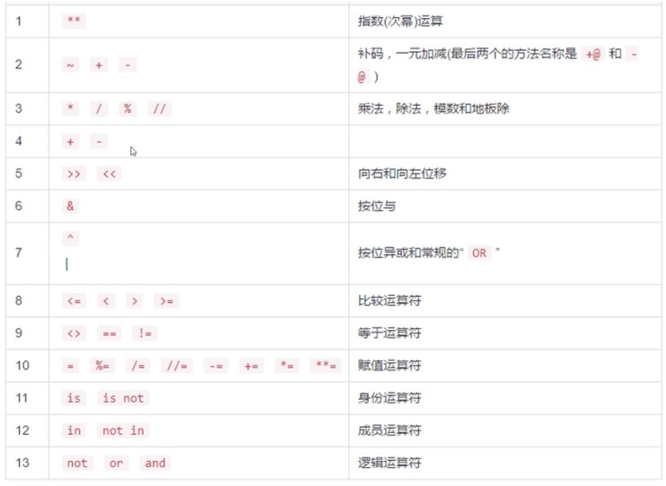

##### 算术运算符
a+b, a-b, a*b, a/b
a%b #取模，求除法余数
a//b #除法取整数
a**b #幂运算，a的b次方

##### 比较运算符

a **==** b
a **>=** b
a **!=** b
a **>** b
a **<** b

##### 逻辑运算符
True **and** False, True **or** False, **not** True

##### 成员运算符
lst = [2,3,4]
dis = {'a':1,'b':2}
print(1 **in** lst) #返回true
print('c' **in** dis) #返回false

##### 身份运算符
a=[1,2,3,4,5]
b=a
c=[1,2,3,4,5]
a is b # True
a is c # False
a is not c # True


## python流程控制语句
python编码规范：
行末尾不强制加分号结尾。不需要用{}包裹代码块，python使用缩进表示代码块
### 1. 条件控制语句 if-else
<b class="danger">pass</b> 语句在python中用来作占位，使语句能顺利执行下去不出错
```python
1 if condition_test:
2   pass
3 elif condition_test2:
4   pass
5 else:
6   pass
```
<b class="asso">ES:if () {} else if () {} else {}</b>

### 2. match 条件判断
```python 
match status_code:
    case 400:
        print("Bad Request")
    case 404:
        print("Not Found")
    case _: #默认情况
        # 执行默认情况的代码，即所有其他未被明确匹配的情况
```

### 3. 循环while else
```python
1 while condition:
2   pass1
3 else:
4   pass2 #else是condition条件为false时执行的代码块

1 count =1
2 while count <=10:
3   count +=1
4   print(count)
5 else:
6   print('EOF')
```
while循环的使用场景是，设定condition为条件判断，condition条件为true时就一直执行语句块，条件判断为<b class="danger">false</b>时就执行<b class="danger">else</b>后面的语句块。while多用在递归的场景中。

<b class="asso">ES: while(){}, do{} while</b>

### 4. 循环for else
for 循环用来遍历/循环 序列、集合、字典

for **target_list in expression_list**:
    pass1
else:
    pass2
<b class="danger">else</b> 语句块在for循环<b class="danger">正常结束</b>（**非break终止**）后执行
```python
1 a = [['a','b','c'],(1,2,3)]
2 for i in a:
3   print(i,end='--')
4   for y in i:
5       print(y,end="|")
6 else:
7   print('EOF iterate done')
```
print(a,<b class="danger">end = '|'</b>)
print函数使用<b class="danger">end参数</b>可以将需要打印的元素横向间隔排列。

### 5. 循环-列表推导式

new_list = **[** expression for item in iterable **if** condition **]**
```python 
list1 = [1,2,-3,5,6,9,-10]
new_list = [item * 2 for item in list1 if item>0]
print(new_list)
```

### 6. 循环控制 终止循环 使用break, continue
break 终止循环跳出整个循环，continue 跳过本次循环但会继续执行下一次循环。<b class="danger">break</b>会<b class="danger">中断</b>for循环遍历，使for循环结束后的else不执行，但<b class="danger">在循环嵌套的场景下，break只会中断所在层级的循环</b>，<b class="danger">对外层循环不会中断</b>
```python
1 a = [1,2,3]
2 for x in a:
3   if (x == 2):
4       break
5   print(x, end='|')
6 else:
7   print('EOF')
8 # x==2时终止循环，整个过程只会打印出1|, break语句终止循环后
```

```python
1 a = [1,2,3]
2 for x in a:
3   if (x == 2):
4       continue
5   print(x, end='|')
6 else:
7   print('EOF')
# x==2时跳过本次循环，整个过程会打印出1|3|EOF
```

#### for循环的范围限定使用range()函数
<b class="asso">ES for 循环：</b>
```js
1 // js文件
2 let a = [1,2,3,4,5,6,7,8,9,10]
3   for (let i =0;i <= a.length; i ++) {
4       console.log(i+'|')
5 }
```

```python
# python文件
1 for i in (range(0,10)):
2   print(i)
3 # 打印出0,1,2,3,4,5,6,7,8,9 共10个数字

1 for i in (range(0,10,2)):
2   print(i)
3 #打印出0，2，4，6，8 共5个数字，range()函数的第三个参数表示步长
```

#### range列表和生成器
**range(num1, num2, length)**
range范围num1是起始数值，num2是终止数值但不包含num2，length是步长，步长可以为负数表示递减。
<b class="danger">range生成一个整数区间,不包含末尾一位，</b>类型为`<class range>`， <b class="danger">range不是一个列表但可以使用索引访问值，使用括号表示range，逗号表示范围,</b> **第三个参数代表步长**。使用 **list()** 函数可以生成由 **range** 指定区间范围的 **列表** ，使用 **tuple()** 可以生成指定范围**元组**，使用 **set()** 可以生成指定范围 **集合**
```python
1 for x in range(10,2,-2):
2   print(x)
3 #结果打印出10，8，6，4

x = range(0,5)
y = tuple(x) #转成元组
y
(0, 1, 2, 3, 4)

y1 = list(x) #转成列表
y1
[0, 1, 2, 3, 4]

y2 = set(x) #转成集合
y2
{0, 1, 2, 3, 4}
```


## python 工程组织结构
### 包、模块、类
python项目的组织结构，最顶级的层级<b class="danger">包</b>层级（类似文件夹），然后是<b class="danger">模块</b>层级（类似文件）、最后是写在模块文件中的<b class="danger">类</b>。**包的文件夹结构是可以嵌套的** 

<b class="danger">  \_\_init__.py 是一个包被导入的时候自动执行的文件，当导入包，或者导入包下面某个模块的某个变量时 \_\_init__.py 文件也会自动执行。</b> 包和包中某个模块中的某个变量被导入时都会自动执行\_\_init__.py

文件夹下如果有 <b class="danger">\_\_init__.py</b> 文件，则代表该 <b class="danger">文件夹是一个包</b> ,如果一个文件夹下**没有\_\_init__.py**则python认为该文件夹是**普通文件夹**。

**\_\_init__.py**本质上就是一个模块文件，\_\_init__.py文件可以写代码，<b class="danger">也可以不写只是用来标注一个包。</b>

<b class="danger">\_\_init__.py模块的名称就是包的名称，</b>比如**seven**目录下有__init__.py，则__init__.py**模块的名称就是seven**。

一个 .py 文件可以称为模块，包含了 \_\_init__.py 文件的称为包。

**\_\_init__.py 常用来执行模块导入时的初始化动作，比如用来收敛包（文件夹）下各模块公用的类库/模块**


不同包下同名的模块，使用**命名空间**来区分
```python
1 seven.c4
2 six.c4 
3 #seven,six 是包名称，c4是模块名称
```

#### 导入模块的方法
##### import
```python
1 import module_name # 导入同级目录下的某个模块
2 import a1.module_name #导入同级目录下a1目录下面的module_name模块
3 import t.b.c7 as m #导入t/b下的c7模块，并使用m表示，调用c7模块时使用m.a调用
```

**python的导入无法像js语言一样导入js模块的某个变量或函数**，<b class="danger">python只能导入整个模块文件，然后使用命名空间来访问模块下的某个变量。</b>
```js
1 // js文件
2 // require
3 const module = require('module')

// exports 
5 export.fs = fs 
6 module.exports = fs

8 // import
9 import fs from 'fs';
10 import {  fs as newFs } from 'fs'; // ES6语法, 将fs重命名为newFs, 命名冲突时常用import { a as b}
11 import fs, { part } from fs; //表示从文件系统模块中导入默认导出和名为part的具名导出。

12 // export 
13 export default fs;
14 export const fs;
15 export function part;
16 export { part1, part2 };
17 export * from 'fs'; //将模块 'fs' 中的所有导出内容重新导出到当前模块

```

#### from import 
导入某个包/模块下的局部变量或局部函数
from t.c7 import a  导入**t.c7**模块下的**a**变量，调用a变量时可直接使用 **.方法** 调用
from t import c7# 导入t模块下的c7模块，调用a变量时使用**c7.a**调用
from t.c7 import a, b, c #导入t.c7模块下的a,b,c三个变量
from t.c7 import (a, b
c) 导入t.c7模块下的a,b,c三个变量,c变量可以在括号内换行,需要导入多个变量（换行）时，使用**括号**包裹
from t.c7 import * 导入t模块下c7模块下的所有变量

<b class="danger">import方法导入的是模块，from import 导入的可以是某个变量也可以是某个模块</b>

#### \_\_init__.py 文件定义导入文件
导入一个包时,\_\_init__.py文件会自动执行，使用\_\_init__.py文件导入变量使用场景
在**包t**下的\_\_init__.py模块文件中编写需要多次重复导入的模块，比如
```python
1 #__init__.py文件
2 import sys
3 import datetime
4 import io
```

在其他目标文件中直接导入包t即可导入包t下\_\_init__.py模块文件中所导入的变量/库
```python
1 import t
2 print(t.sys)
```
#### 导入模块注意事项
1. 包和模块**不会被重复导入**，**多次**引用同一个包或模块，但其导入过程**只会执行一次**。
2. 当导入某个模块时，该模块文件中的代码会**自动执行一次**。
3. 避免循环导入
4. **如果一个.py文件被当作python执行的入口文件，这个.py文件的顶级不会有package包，即便当前.py文件同级路径存在\_\_init__.py也不会打印出\_\_package__**，即如果python直接执行这个.py文件时，这个.py文件中的\_\_package__为NoneType。**如果一个.py文件被当作模块导入后，这个.py文件中的\_\_package__会指向其命名空间路径**。
5. **如果需要将某个c15.py入口文件当作模块调用可以使用`python -m seven.c15` 明确c15.py的顶级包seven，并使用-m的方式调用，此时c15.py文件的\_\_package__就不为NoneType**

#### 相对导入、绝对导入
import package2.package4.m2 #绝对路径导入，根据文件路径导入某个模块

from .m3 import m #相对路径导入，导入相对于当前路径下的m3模块

from ..m4 import m #相对路径导入，导入相对于当前路径，上一级目录下的m4模块

注意，<b class="danger">使用相对路径导入时，不能超过当前模块的顶级包路径，否则出现以下错误</b>
**attempted relative import beyond top-level package**

<b class="danger">在python项目的入口文件中，不能使用相对路径导入模块，只能使用绝对路径导入。或者使用相对路径导入，但将入口文件当成模块调用(加-m参数)</b> 
`python -m pkgName.moduleName` *明确入口文件的顶级包*

<b class="danger">绝对引入，要从顶级包开始写 top.ab.cd</b>, **顶级包的位置是相对于python执行入口.py文件的位置来确定的**


*添加绝对路径后再导入包*
```python
1 import sys
2 sys.path.append('c:\\users\\desktop') #添加一个绝对路径
3 import packageName1 #添加绝对路径后可以直接导入绝对路径下的包
4 packageName.fn1('hello world')

```

### 模块的内置变量
python c15.py #python 将c15.py <b class="danger">当作程序入口</b> 文件直接执行 
python <b class="danger">-m</b> seven.c15 #python 将seven目录下的c15.py文件 <b class="danger">当作模块调用</b> （.py文件当作模块调用时必须有包的环境(加<b class="danger">.</b> )，**seven**目录这时候就是包），这种方式不同于python seven\c15.py#仍然是当入口文件调用

**main.py入口文件不是顶级包，只是入口文件**

`info=dir()`
`print(info)`
<b class="danger">dir()函数</b> 
如果没有**提供参数**，dir()函数将返回**当前作用域内的有效属性列表**。如果**提供了参数**，dir()函数将返回该**参数对象的有效属性列表**。dir()函数通常用于查看对象的属性，以便在编程时了解可以对对象进行哪些操作。

**带双下划线的是python的内置变量**
\_\_annotations__
\_\_builtins__
\_\_cached__
<b class="danger">\_\_doc__</b> 当前模块的注释信息
<b class="danger">\_\_file__</b>当前模块文件相对于**执行入口文件所在目录的**文件路径
\_\_loader__ 引用了本模块的加载器对象，即该模块的上下文是由这个加载器加载到内存中的
<b class="danger">\_\_name__</b> 当前模块的完整名称，包含了命名空间，比如t.c9
<b class="danger">\_\_package__</b>  当前模块 <b class="danger">所在的包</b> 名称比如t，**相对于执行入口文件所在的目录**
\_\_spec__
**\_\_init__.py** python检测到一个目录下存在\_\_init__.py文件时，python就会把它当成一个模块
\_\_all__ 在某个模块文件中指定可以被导出的变量，或在\_\_init__中指定可以被导出的模块
**\_\_closure__[0].cell_contents #查看对象的闭包变量**

当一个模块是程序的**入口文件**时即执行**python abc.py**时，该模块文件的 **\_\_name__** 会显示为 <b class="danger">\_\_main__</b>  ，**\_\_file__**文件路径会显示为**当前模块的文件名**（没有路径）

<b class="danger">\_\_name__的经典应用</b>
`make a script both importable and executable` 让一个脚本既可被当作模块导入，也可被解析执行
```python
1 #t1.py文件
2 if __name__ == '__main__':
3   pass1
4 pass2
```
当t1.py作为 <b class="danger">程序入口</b> 直接 <b class="danger">执行</b> 的时候会执行**pass1**, 当t1.py <b class="danger">被其他模块导入时</b> t1.py只会执行**pass2**，不执行pass1


## 函数
定义函数
```python 
def fn(param1, param2 = 'abc'):  #param2是函数参数默认值
    pass
    return val1
```

#### 函数的多个返回值
```python 
def damage(sk1,sk2):
    val1 = sk1 * 2
    val2 = sk2 * 2
    return val1,val2 

resule1, resule2 = damage(2,3)
```
**返回多个值**，使用**逗号分隔开**，逗号分隔开的返回值其**类型是元组tuple**
**获取**函数的**多个返回值**的时候，用逗号分隔声明变量**解构赋值**方法，**接收结果**的变量和函数内部**返回值的先后顺序**有关

#### 声明多个变量
```python 
a,b,c=1,2,3 #a=1, b=2, c=3
a,b,c=[1,2,3] #a=1, b=2, c=3
a,b,c=(1,2,3) #a=1, b=2, c=3
a = 1,2,3 #a=(1,2,3)
```
`a,b,c=1,2,3` 
`a,b,c = d` d是序列类型时（**tuple,list**），此时a,b,c会序列解包
`a = 1, 2, 3` #a赋值后是tuple类型
<b class="asso">ES: let a=1,b=2,c=3 或者 let {a,b,c} = {a:1,b:2,c:3}</b>

##### 链式赋值
`a=b=c=1` a=1,b=1,c=1
<b class="asso"> let a=b=c=1</b>

#### 函数参数
##### 1. 必须参数
```python 
def fn(x,y):
    return x+y
```
调用时传入的实际参数必须和形式参数个数一致且顺序一致

##### 2. 关键字参数
```python 
def fn(x,y):
    return x+y
```
调用时传入的参数不用考虑顺序，只需要参数名和形式参数一致即可`fn(x=1,y=2)`
<b class="asso">ES:通过解构赋值实现调用函数时不考虑参数传入顺序</b>
```js
function fn({x,y}){
    return x+y
}
fn({y:2,x:1}) //不考虑参数传入的顺序
```

##### 3. 默认参数
```python 
def fn(x,y=2):
    print(f"x is {x},y is {y}")
```
调用时`fn(1) #x1,y2`
调用时`fn(3,4) #x3,y4`
python语法要求，python中有 <b class="danger">默认值的参数</b>要放<b class="danger">末尾</b> ，声明函数时，**必须参数靠前**，有默认值的**默认参数尽量放后面**。


##### 4. 可变参数
```python 
def fn(*param):
    print(param)
```
调用时 fn(1,2,3,4,5), 打印param时(1,2,3,4,5)会自动将参数列表转换成**tuple**，函数内部定义的可变参数param会 <b class="danger">自动收敛传入参数，并转成tuple</b> 
```python 
def fn(x,y,z):
    print(f"x is {x},y is {y}, z is {z}")
```
<b class="danger">fn(\*(1,2,3))</b>
调用时 fn(*(1,2,3))使用\*调用将传入的参数tuple平铺**逐一匹配**到函数内部的**形式参数**位置

<b class="asso">ES: 参数收敛</b>
```js
function fn1(...param){
    console.log(param)
    // 调用fn1(1,2,3,4)时，param被收敛为[1,2,3,4]
}

function fn2(x,y,z) {
    console.log(x, y, z)
}
//调用fn2(...[3,4,5])时，...[3,4,5]被平铺到函数中的形式参数位置
```

##### 5. 关键字可变参数
收敛传入的关键字参数，基于字典的可变参数，传入参数转成dict格式
```python 
def fn(**param)
    print(param)
```
<b class="danger">将传入的参数收敛为dict</b> 
调用时`fn(x=1,y=2,z=3)`,param为{'x':1,'y':2,'z':3}

```python 
def fn(x,y,z):
    print(f'x is {x},y is {y},z is {z}')
```
调用时`fn(**{'y':3,'z':2,'x':4})` 不用强调传入参数的顺序x4,y3,z2


## 变量作用域
#### 函数的局部变量和全局变量
局部变量只能在其被声明的函数内部访问，而全局变量可以在整个全局上下文环境访问。
**某个模块中函数内部global关键字定义的全局变量也是可以被其他模块导入使用的**
<b class="danger">函数内声明全局变量</b> 
```python 
def fn():
    global a
    a  = 'default'

fn() #fn函数执行后创建了一个全局变量a
```
#### 作用域
函数内部定义的变量（局部变量）作用域在函数内部，函数外部无法引用函数内部变量（闭包除外，还可以使用global关键字变量在函数内部定义全局变量）。但函数内部可以引用全局变量即函数外部定义的变量，或者嵌套函数，其内部变量可以引用外层变量。
```python 
c=10
def fn():
    print(c) #打印出10
```
注意：python只有**全局作用域**、**函数作用域**的概念，python**没有代码块级的块作用域**。在python中，**for循环，while循环，if..else等非函数不能形成独立的块作用域**。所以python for循环中声明的变量，**在for循环外部**是**可以访问**的。<b class="danger">不同于JS，有块级作用域。</b> 


## 面向对象
类：用class定义，类变量 <b class="danger">首字母大写，驼峰命名法</b>，类的最基本作用是用来封装代码。类中定义的函数即方法。类就是对现实世界的抽象定义。
```python 
class Student():
    sum = 0
    age = 0
    #构造函数，初始化实例，self指向实例对象
    def __init__(self,name,age):
        self.name = name
        self.age = age
    def fn(self):
        print(self.name,self.age)

# 实例化stu1
stu1 = Student('json',18)
# 调用实例的方法
stu1.fn()
```
在定义类class的实例的**构造函数**和**方法**时， <b class="danger">必须显式的传入第一个参数self</b>

#### 导入类
```python 
from c1 import Student()
stu2 = Student('penny',18)
stu2.fn()
```
#### 类和对象的关系
**类**是现实世界或思维世界中的实体在**计算机中的一种抽象反映**，将抽象出的实体，其 <b class="danger">属性</b>和对属性的操作即<b class="danger">方法</b> 封装在一起。简单理解，类抽象出**实体的特征与行为**，类基本可以理解为模板对象，即通过类**实例化**出的一个**实例**。
```python 
class Studen():
    name= 'default value'
    age= 0
    def __init__(self, name, age): #python类的构造函数
        self.name=name #通过构造函数的执行来初始化对象的属性
        self.age=age #通过构造函数的执行来初始化对象的属性
```
**实例化**一个实例时，类的**构造函数会自动执行**。构造函数或实例方法内的**self**始终**指向实例**。
<b class="asso">ES:类的定义方法
</b>
```js
class Student{
    constuctor(name,age) { //构造函数
        this.name=name
        this.age=age
    }
    fn() { //实例方法
        console.log(this.name) //this指向实例对象
    }
    static fnStatic() { //类class的静态方法
        console.log(this) //静态方法中this指向的是类而不是实例
    }
    static valStatic = 'default' //类的静态属性
}
```

#### 类变量、实例变量
类变量即类自身的**静态属性**，类变量要**和类关联在一起**，**体现出类的意义**。
实例变量即类**实例化后的属性**，实例化后生成对象的属性。实例变量和对象关联在一起
```python 
 class Student():
    sum=0 #类的变量，与类相关联，JS类的变量用static静态属性表示
    def __init__(self, name, age): #self只是占位符，可以用this替代
        self.name=name #实例变量
        self.age=age #实例变量
        self.__class__.sum += 1 #构造函数中访问类的属性
    def fn1(self): # 定义函数的时候参数传入self，表示该函数是实例的方法
        print(self.name) #访问实例的属性
        print(self.__class__.sum) #访问类的属性
        print(Student.sum) #访问类的属性
```

#### 类与对象的变量查找顺序
`stu1 = Student()`

stu1<b class="danger">.\_\_dict\_\_ </b> **对象（包含类或者实例）的__dict__对象中保存了当前对象的所有变量**
注意：类的静态属性（类变量）和实例属性（实例变量）的查找顺序，如果查找一个实例的变量，首先在实例属性中查找，如果找不到就去类的静态属性中查找，如果类中找不到就会去类的父类中中查找。
<b class="asso">ES:JS的原型对象</b>

##### 在实例方法中访问实例变量与类变量
实例方法中访问实例变量，<b class="danger">self.val</b> 
实例方法中访问类变量：<b class="danger">ClassName.val</b>  或者 <b class="danger">self.\_\_class\_\_.val</b> 


#### 类方法 即类的静态方法
```python 
class Student():
    name=''
    sum=0
    def __init__(self,name,age):
        self.name=name
        self.age=age
    def fn(self):
        print(self.name)
        print(Student.name)
        print(self.__class__.name)

    @classmethod #装饰器，定义类的方法，即类的静态方法
    def fn2(cls):
        cls.sum += 1 #访问类的属性
```

`@classmethod` 定义类的静态方法时增加 **@classmethod装饰器** 
显式的传入第一个参数cls,传入的参数 **cls** 表示 **class** ，可以使用其他变量代替。
类的方法中访问类的属性，访问类的属性cls.val，和实例方法中 <b class="danger">self.\_\_class\_\_.val</b> 等价，等价于 <b class="danger">ClassName.val</b>。
调用类的方法：ClassName.fn2()
通过类的实例调用类的方法(不建议这么调用没意义):
`ins1 = ClassName()`
`ins1.__class__.fn2()`


#### 成员可见性
对类的变量即类的静态属性的操作，放到类的静态方法中，或者实例方法中去操作。不建议在外部直接操作类的属性比如 `ClassName.val = 1`  这种操作不建议。**成员的可见性即设置私有方法或私有属性，不允许从外部访问或修改，体现封装性**。

**类的私有方法** 在一个类中定义的方法(类方法或者实例方法)名称前面加<b class="danger">\_\_</b>表示该方法为类的私有方法，私有方法在类的外部无法调用，比如`ClassName._fn()`

**私有变量** 在变量名前加<b class="danger">\_\_</b>该变量就成为私有变量，私有变量只能在对象内部访问，无法在外部访问，比如`obj.a`
```python 
class Student():
    __abc = 'private val' #声明类的私有变量
    def __init__(self,name,age):
        self.name=name
        self.age=age
        self.__instval = '这是实例的私有变量' #声明实例的私有变量
    def fn(self):
        print(self.name) 
        print(self.__instval) #内部访问实例的私有变量
        print(Student.__instval) #内部访问类的私有变量
        print(self.__class__._Student__instval) #内部访问类的私有变量
        self.__privateMethod() #Student类的内部访问私有方法
    def __privateMethod(self): #声明类的私有方法
        self.__abc = 'modify private val' #操作类的私有变量
        print(self.__abc)

stu1 = Student('a',18) #实例化stu1
```
**注意：**
以上代码中直接访问`Student.__abc` 或者 `Student.__privateMethod`会提示错误，无法直接通过类访问类的私有属性和方法。但可以通过hack方法变通访问`Student._Student__abc`或者`Student._Student__privateMethod`

以上代码中访问直接访问`stu1.__abc` 或者 `stu1.__privateMethod`会提示错误，无法直接通过实例访问**父类的**私有属性和方法。但可以通过hack方法变通访问`stu1.__class__._Student__abc`或`stu1.__class__._Student__privateMethod`
或`stu1._Student__abc`或`stu1._Student__privateMethod`

以上代码中直接访问`stu1.__instval` 会提示错误，无法直接通过实例访问实例的私有属性，可以hack方法变通访问`stu1._Student__instval`访问。由此看出构造函数中声明的实例私有属性，也被挂载到类的私有属性上。

python中类的构造函数中定义私有属性后，可通过 **\_\_dict\_\_** 查看实例的所有变量，可以发现私有属性被改名为 **\_ClassName\_\_privateVar** ,即在 **\_类** 名后面加私有属性.

python中虽然有私有变量概念，但私有变量还是可以通过hack方法访问的，通过__dict__可以知道python的私有变量只不过通过改名实现的，所以通过instance._ClassName__privateVar 可以访问到私有变量

`obj._val = 1` 这种看似在外部修改了名称为_val的私有变量，实则是由于**python有动态语言**的特性，在obj对象上增加了一个名称为_val的变量并设置值为1。所以，python中不能动态的添加一个私有属性。python中的私有属性和方法都被自动添加了 **\_ClassName** 前缀。


示例2
```python 
class Humman():
    sum = 0
    __hmval = 'humman class private val' #声明类的私有变量
    def __init__(self,country):
        self.country=country
        self.__huminst = 'humman instance private val' #声明实例的私有变量
    def getCountry(self):
        print(self.__huminst) #内部访问私有变量
        print(Humman.__hmval) #内部访问类的私有变量
        print(self.__class__._Humman__hmval) #内部访问类的私有变量

print(Humman._Humman__hmval)
#类，访问私有变量，返回humman class private val

hum1 = Humman('中国')
print(hum1.country)
#访问实例的属性，返回中国

#print(hum1.__huminst)
#直接访问实例的私有变量，返回错误信息

print(hum1._Humman__huminst)
#在实例上访问实例的私有变量，返回humman instance private val

hum1.getCountry()
#返回 humman instance private val
#返回 humman class private val
#返回 humman class private val
```


## 面向对象 继承
继承，避免重复定义方法和变量。`Student(Human)`此时Student子类生成的实例，可以访问父类Human上定义的类属性、类方法和父类的实例属性、实例方法。
```python 
class Humman():
    sum = 0
    __hmval = 'humman class private val' #声明类的私有变量
    def __init__(self,country,name,age):
        self.country=country
        self.name=name
        self.age=age
        self.__huminst = 'humman instance private val' #声明实例的私有变量
    def getCountry(self):
        print(self.__huminst) #内部访问私有变量
        print(Humman.__hmval) #内部访问类的私有变量
        print(self.__class__._Humman__hmval) #内部访问类的私有变量

#声明子类，传入Humman父类继承父类
class Student(Humman):
    def __init__(self,country,score,name,age):
        super().__init__(country,name,age) #执行父类的构造函数，继承父类的实例化属性
        self.score=score #子类实例属性
    def get_score(self):
        print(self.__dict__)
        super().getCountry() #执行父类的方法


stu1 = Student('英国',60,'abc',20)
stu1.get_score()
#返回 {'country': '英国', 'name': 'abc', 'age': 20, '_Humman__huminst': 'humman instance private val', 'score': 60}
```


## oop思想
**封装、继承和多态** 是面向对象的三大特征。这三大特征与语言本身无关，这是一种面向对象的编程思想。

**封装** 是为了提高程序的安全性；将数据（属性）和行为（方法）包装到类对象中。而**在方法内部对属性进行操作**，**在类对象的外部调用方法**。这样我们只需要用合适的方式去用它，而不用关心方法是如何具体实现的。

**继承** 承是为了提高代码的复用性；继承就是定义子类，子类继承父类的属性和方法。一个类没有继承任何类，**默认继承object**；Python支持多继承。

**多态** 多态是为了提高程序的可扩展性和可维护性。Python中的多态指的是，在运行过程中根据变量所引用对象的类型，动态的决定调用哪个类对象中的方法。

**Object类是所有类的父类，一个类没有继承任何类，默认继承object**。
类的浅拷贝,Python拷贝一般都是浅拷贝，拷贝时，对象包含的子对象内容不拷贝，因此，源对象与拷贝对象会引用同一个子对象
```python 
import copy
a2 = copy.copy(a1)
```
类的深拷贝,使用copy模块的deepcopy函数，递归拷贝对象中包含的子对象，源对象和拷贝对象所有的子对象也不相同。
```python 
import copy
a3 = copy.deepcopy(a1)
```

## 异常处理
<b class="danger">try...except...finally</b>
出现异常后捕获异常，加以处理，不让程序终止并退出。常见的异常类型有：
Exception, Error, warning, error类型继承自Exception
```python 
try:
    pass #可能会出现错误的代码
except 异常类型 as e #e是异常变量
    pass #出现异常后的处理代码
finally:
    pass # try excpet代码块执行完之后，最终都会执行的代码块
```
except语句可指定异常类型，**如果不指定，则except语句捕获try语句中的所有异常，** 当指定具体异常时则except只捕获try中特定的异常。**多个异常类型的捕获可以放在一起。**

finally代码块中常用来释放资源，比如打开的文件、网络连接、打开数据库的连接、及数据结果集都会占用计算机资源，再finally中释放资源。

```python 
try:
    pass #可能会出现错误的代码
except 异常类型1 as e:
    pass
except 异常类型2 as e:
    pass
except (异常类型3,异常类型4) as e #多个异常类型相似可以合并
except: #没有指定异常类型，默认捕获上面未捕获到的异常
    pass
finally:
    pass #正常流程或捕获错误的流程执行完之后，最终都会执行的代码
```
try...except 可以嵌套，但实际开发中尽量不要嵌套，应梳理好程序执行流程再考虑是否需要try...except嵌套

#### 自定义异常类，继承Exception类
```python 
class customException(Exception):
    def __init__(self,message):
        super().__init__(message)
```

#### 手动触发异常 raise
raise 触发自定义异常
```python 
raise customException('这是一个自定义的异常信息')
```


## 正则表达式 re模块
```python 
import re
```
#### 1. findall函数
re.findall('正则规则'，目标字符串) #查找出与匹配规则的结果，返回结果是list列表

##### 2. 元字符
re.findall(' <b class="danger">\d</b> ', a) #查找0-9的数字
\d、[0-9] #匹配0-9数字
‘\D’ 、[^0-9] #匹配0-9非数字
'\w'、'[A-Za-z0-9_]' #匹配单词字符，即数字和字母和下划线
''\W' #匹配非单词字符符号，包含空白字符符号比如空格，回车，制表符等
'\s' #匹配空白字符符号比如空格，回车，制表符
'\S' #匹配非空白字符
'[\s\S]*?' #匹配除所有字符
'.' #匹配除换行符\n之外的其他所有字符
‘a[**cf**]c’ #查找a开头，c结尾，中间是**c或f**的结果
‘a[**^cf**]c’ #查找a开头，c结尾，中间不是**c或f**的结果
‘a[**c-f**]c’ #查找a开头，c结尾，中间是**c到f**之间的结果

##### 3. 数量词
'[a-z]{3,6}' #匹配a-z之间的字符，最少匹配3位，最多匹配6位，贪婪模式匹配
'[a-z]{3,6}**?**' #匹配a-z之间的字符，最少匹配3位，最多匹配6位，**非贪婪模式**匹配3位即可
'pytho **\***' #匹配pytho**0次或无限多次**
'pytho **+**' #匹配pytho**1次或无限多次**
'pytho **?**' #匹配pytho**0次或1次**

##### 4. 边界匹配
'\^\d{3,8}\$' ^即字符串开始位置，$即字符串结束位置。数字开头，数字结尾，且长度在3-8位之间

##### 5. 组
r = re.findall('(Python){3}', s)
(Python){3} #将Python作为完整的一个分组，判断python是否重复3次
Python{3} #只判断Python中的单一字符n是否重复3次
小括号 **(abc)** 分组后，括号中的字符是且关系，中括号 **[abc]** 中的字符是或关系

##### 6. 匹配模式参数，findall的第三个参数
r = re.findall('正则规则', 目标字符串, re.I | re.S) # re.I即不区分大小写，re.S改变元字符 <b class="danger">.</b> 的匹配规则。多个模式用管道符连接，是且关系
r = re.findall('c#', 'PythonC#JavaPHP', re.I)
r = re.findall('c#<b class="danger">.{1}</b>', 'PythonC#<b class="danger">\n</b>JavaPHP', re.I | re.S) 
目标字符串里面有换行，元字符.是匹配除换行外所有字符，模式参数加上了re.S 就是改变元字符.的匹配特性，匹配包括换行符在内的所有字符。

##### 7. 正则替换，返回结果是字符串
r = re.sub('C#', 'GO', 'PythonC#JavaPHP',0) #第二个参数是要替换成的字符串，第4个参数count设置为0是不限制替换次数
第2个参数可以定义成函数，实现更复杂的需求，**比如第一个参数定义的匹配规则匹配出的是变量的时候**
```python 
def convert(value):
    mached = value.group() #value是匹配到正则结果的match对象
    return 'AA' + mached + 'AA'
r = re.sub('C#', convert, 'PythonC#JavaPHP', 0)
```
第1个参数匹配到之后会传入到convert函数中（convert函数中定义的value参数就是匹配上规则的一组match对象），返回函数执行的内容
示例
```python 
def fn(value):
    matched = value.group()
    if(int(matched)>=6):
    return '9' #这里必须返回字符串，因为正则只能操作字符串
    else:
    return '0'
re.sub('\d', fn, 'A8C3721D86', 0)
```
函数作为参数传入另一个函数，就是高阶函数

##### 7. re模块中的search,match函数
re模块中除了findall之外的其他两个函数search, match，，只匹配一次，**返回结果是match对象** r = re.match('\d', 'A83C7') #返回结果为None，因为match函数会从目标字符串的**首字母**开始匹配，如果首字母没匹配到就返回None

r = re.search('\d', 'A83C7') #search函数会搜索整个字符串，直到找到第一个匹配的结果就会**返回match对象**

##### 8. group()方法
match对象需要使用group()方法来获取具体的结果
r=re.search('life<b class="danger">(.\*)</b>python<b class="danger">(.\*)</b>python', 'life is short, i use python, i love python')
r.group(0) #获取所有分组匹配内容，即返回完整的匹配结果 'life is short, i use pyhon, i love python'
r.group(1) #获取第一个分组(.\*)匹配的内容，即'is short, i use '
r.group(2) #获取第二个分组(.\*)匹配的内容，即', i love'
r.group(0,1,2) #获取指定分组已元组形式返回  ('life is short, i use pyhon, i love python', 'is short, i use ',', i love')

##### 9. groups()方法
m = re.match(r"(\d+)\\.(\d+)", "24.1632")
m.groups() #返回('24','1632')


## JSON
JSON是轻量级的数据交换格式。JSON是数据格式，常见的数据格式还有XML数据格式。字符串是JSON的表现形式，符合JSON格式的字符串就是JSON。

python中JSON和 **字典** 格式一样，在 **JS中JSON和对象格式**一样，在每种语言中都有特定的数据格式与JSON对应从而实现转换。

#### JSON反序列化 
转换json格式字符串为JSON，必须是标准格式的JSON字符串`'{"name":"abc"}'`
python JSON 转字典
```python 
import json
ditc1 = json.loads(jsonStr) #将str格式的json字符串转成dict
```
<b class="asso">ES: JSON.parse(jsonString)</b>

数组JSON对象也能被反序列化为python中的list
`list1 = json.loads('[{"name":"a1"},{"name2":"a2"}]') `
<b class="danger">这里一定得是字符串格式的list，且list内的每个成员是字符串的JSON格式</b> 

```python 
import json
list1 = json.loads('[{"name":"a1"},{"name2":"a2"}]') #字符串格式list转成list
print(list1) #返回list格式
print(type(list1)) #list

list1Str = json.dumps(list1) #将list格式转成字符串格式list
print(list1Str) #返回字符串格式list
print(type(list1Str)) #字符串

abc = json.loads('[{"a":1,"b":2},{"c":3}]')
print(abc) #返回list [{'a': 1, 'b': 2}, {'c': 3}]
```

<b class="asso">ES: JS中也能将字符串格式数组对象转成数组对象，JSON.parse(jsonString)</b>

JSON数据类型与python数据类型
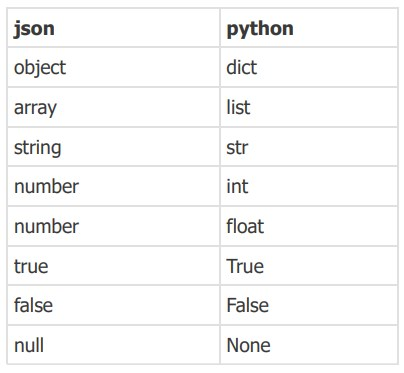

#### JSON序列化
将JSON数据格式转成JSON格式字符串
```python 
import json
jsonStr = json.dumps(jsonObject)
```
<b class="asso">ES: JSON.stringify(jsonObject)</b>
JSON：一种通用的数据交换格式，支持各种语言。在每种编程语言中都有特定的数据类型和JSON格式可以转换。
JSON字符串：符合标准JSON语法格式的字符串
JSON对象：只在JS语言中存在JSON对象，在python中是dict，或list dict


## 枚举
枚举（enum）是一种特殊的类，通过enum模块提供，主要用于定义**一组命名的常量集合**，每个枚举成员都有一个**唯一**的**名称**和**关联值**

枚举其实是一个类，枚举不可实例化。**枚举就是列举出有穷集合的所有元素，枚举的成员** <b class="danger">不可修改</b> ，且枚举类型中 <b class="danger">没有重复成员名称name</b>，**但成员名称对应的值可以相同，后面相同值对应成员名称name相当**<b class="danger">于是别名</b>

常规的class类、dict类型中定义的属性或变量可以被修改，且类中定义的属性存在相同值的可能，无法确认属性的唯一性。
```python 
class TypeDiamond():
    yellow = 1 # 无法确认属性的唯一性
    red = 2
    green = 1 # 无法确认属性的唯一性
```
`abc = {'yellow':1,'red':2, 'green':1}`
以上方法定义的属性或变量可被修改，且存在值相同的变量，无法区分唯一性。

```python 
from enum import Enum
class VIP(Enum):
    YELLOW=1
    GREEN=2
    abc=2 #因为枚举值相等，所以后面的abc相当于是前面GREEN的别名
```
`VIP.YELLOW =2` 会提示报错，因为枚举类型不能修改
`VIP.YELLOW` VIP.YELLOW 获取的是一个枚举类型即`<enum 'VIP'>`，不是具体的值
`VIP.YELLOW.value` 取枚举类型中标签对应的枚举
`VIP.YELLOW.name` 获取枚举类型中枚举名称
**abc相当于是GREEN的别名，abc的值与GREEN的值相同**

#### 遍历枚举
```python 
for v in VIP:
    print(v) #返回VIP类中的所有的枚举类型
```
**枚举的运算比较**，**枚举类型之间**只能判断**是否相等**(===)，**是否同一身份**(is)
`VIP.YELLOW == VIP.YELLOW` 返回True
`VIP.YELLOW == VIP.GREEN` 返回False
`VIP.YELLOW == 1` 会返回False，不是枚举类型之间比较
`VIP.YELLOW is VIP.GREEN` 返回True

#### 枚举转换
当一只某个值，要根据该值匹配出某个枚举类型中的成员
```python 
a=1
VPI(a) #返回VIP.YELLOW枚举类型
```


#### 使用枚举代替数字来进行分类
如果项目中需要通过不同的数字来判断不同的类别，可以使用枚举类型来表示这些数字，可以将数字转换成相应的枚举成员来处理。例如邮箱，手机，微信小程序，微信公众号这几类注册方式，用户请求传过来的数字在后端处理的时候，总不能直接使用100，101这样的数字来区分不同的注册方式。
```python 
from enum import Enum
class ClientTypeEnum(Enum): #继承枚举类型
    USER_EMAIL=100
    USER_PHONE=101
    USER_MINA=200
    USER_WX=201
```


## 闭包
<b class="danger">函数及函数声明时所在的环境变量的集合叫闭包。</b>
** 可在函数外部调用函数内部的局部变量。闭包可以保存函数的环境变量，避免函数执行后环境变量被垃圾回收。**
查看某个函数的闭包使用 <b class="danger">.\_\_closure\_\_[0].cell_contents</b>
```python 
def curve_pre():
    a = 25
    def fn():
        return a + 5
    return fn

f = curve_pre()
f.__closure__[0].cell_contents
```

```python 
def save_steps(x):
    origin = x
    def walk_step(step):
        nonlocal origin #nonlocal 声明引用的是外层函数的局部变量
        origin += step #如果不使用nonlocal显示声明，此行修改变量会提示变量不存在的错误

        print(origin)
        return origin
    return walk_step

fn = save_steps(0)
fn(2)
print(fn.__closure__[0].cell_contents)
fn(6)
print(fn.__closure__[0].cell_contents)
fn(12)
print(fn.__closure__[0].cell_contents)
```
**需要修改闭包局部变量时，首先要使用nonlocal显示声明变量不是内层函数的局部变量**，否则会提示变量不存在错误

## Lambda 表达式 匿名函数 
lambda表达式定义匿名函数 ``lambda parament_list: expression``,**lambda表达式后面只能是 <b class="danger">一个简单的表达式</b> ，不能是复杂的代码块，lambda表达式不需要使用return**。通常lambda表达式是一行的匿名函数，但也可以通过反斜杠和括号来实现换行。
```python 
#定义普通函数
def add(x,y):
    return x+y

#lambda表达式定义匿名函数
lambda x,y: x + y
#匿名函数的调用
f = lambda x,y: x+ y
f(1,2)

(lambda x,y:x+y)(1,2)
```

<b class="asso">ES: JS匿名函数</b>
```js
(function(x,y){
    return x+ y 
})(1,2)

(x,y)=> x+ y
```

## 三元表达式
**条件为真时返回的结果x  if 条件判断 else条件为假时返回的结果y**
`resunt = x if(expression) else y` 返回x时必须满足expression中的条件，否则返回y

<b class="asso">ES: JS三元表达式</b>
`(expression)?x:y`


## 函数式编程
函数式编程 属于声明式编程中的一种，它的主要思想是**将计算机运算看作为函数的计算**，也就是**把程序问题抽象成数学问题**去解决。函数式编程中，我们可以充分利用数学公式来解决问题。也就是说，任何问题都可以通过函数（加减乘除）和数学定律（交换律、结合律等），一步一步计算，最终得到答案

#### map函数
**map函数返回的是map类**，结果使用 <b class="danger">list(</b>map_x<b class="danger">)</b>  转成列表
**map函数把要遍历的目标对象逐一传入前面的函数中进行处理**,返回一个map类
```python 
list_x = [1,2,3,4,5,6,7,8]
list_y = [1,2,3,4,5,6]

def square(x):
    return x * x

#方法一 for...in循环
for x in list_x:
    square(x)

#方法二 map函数遍历
r = map(square,list_x)
#返回结果[1，4，9，16，25，36，49，64]

#使用lambda表达式定义匿名函数,简化代码
r1 = map(lambda x: x*x, list_x)
print(list(r1))
#返回 [1, 4, 9, 16, 25, 36, 49, 64]

#使用lambda表达式定义黎明函数，简化代码
r2 = map(lambda x,y:x*x +y, list_x,list_y) #这里传入的是两个list参数
#返回 [2, 6, 12, 20, 30, 42]
```

#### filter函数
**返回一个过滤后的集合**，结果使用 <b class="danger">list(</b>fliter_x<b class="danger">)</b>  转成列表
```python 
list_x = [1,0,1,1,0,1,0]
r = filter(lambda x: True if x > 0 else False, list_x)
print(list(r))
#返回[1,1,1,1]
```
<b class="danger">filter函数中的lambda表达式的返回值必须为布尔值或者0，1类布尔值，</b>即必须是能表示真假的值


#### reduce函数
**每次的计算结果作为下一次计算的参数**
```python 
from functools import reduce
list_x = [1,2,3,4,5,6,7,8]
r = reduce(lambda x,y:x+y, list_x, 10)
```
**reduce函数的第三个参数10是初始值**


## 装饰器
当需求变更之后，不可避免要修改代码，修改代码尽量遵循原则（对修改是封闭的，对扩展是开放的），不要修改函数和对象的定义，**应该通过扩展一个函数，或者扩展一个类来解决需求变更的问题**。 为一个函数增加功能，而不修改原有函数的代码,不改变原有函数的基础上，增加新的功能。

开闭原则 <b class="danger">对修改是封闭的，对扩展是开放的</b>

装饰器的使用场景
1. 当需要对某一个封装的单元比如某个函数做出修改，可以在不修改原有函数的基础上使用装饰器的形式扩展原有函数的功能进而达到间接修改原有函数
2. 需要复用某个函数的功能

```python 
import time

def decorator(func):
    def wrapper(): #定义扩展原函数的代码
        print(time.time())
        func()
    return wrapper #返回扩展函数

def f1():
    print('This is a function')

f = decorator(f1)
f()

#使用装饰器语法糖简化以上调用
@decorator
def f1():
    print('This is a function')
f1() #直接执行f1()函数，不用像上面代码一样改变调用函数的调用方式 f = decorator(f1) f()
```

<b class="danger">python装饰器的语法糖 @符号</b> 
@符号语法糖，不改变原有函数，增加新功能，代码没有改变f1的内容，调用时直接调用f1()

**使用装饰器语法糖后可以直接执行f1()函数，不用像上面代码一样改变函数的调用方式** 
`f = decorator(f1)` 
`f()`


#### 单函数参数场景的装饰器函数
```python 
import time

def decorator(fn):
    def wrapper(fn_name):
        print(time.time())
        fn(fn_name)
    return wrapper

@decorator
def f1(fn_name):
    print(f'this is a function named {fn_name}')

f1('test_name') #调用经过装饰的函数
#返回以下内容
# 1709539265.6746893
# this is a function named test_name
```


#### 多个函数参数场景的装饰器函数
```python 
import time

def decorator(fn):
    def wrapper(*args):
        print(time.time())
        fn(*args)
    return wrapper

@decorator
def f2(fn_name1,fn_name2):
    print(f'this is a function named {fn_name1}')
    print(f'this is a function named {fn_name2}')
f2('test1','test2')

#返回以下内容
# 1709539505.1007066
#this is a function named test1
# this is a function named test2
```

#### 多个函数参数，可变关键字参数的装饰器函数
```python 
import time

def decorator(fn):
    def wrapper(*args,**kw):
        print(time.time())
        fn(*args,**kw)
    return wrapper

@decorator
def f3(*args,**kw):
    print(f'this is a function named {args[0]}')
    print(f'this is a function named {args[1]}')
    print(kw)

f3('test1','test2',a=1,b=2,c=3)

#返回如下
# 1709541640.6559663
# this is a function named test1
# this is a function named test2
# {'a': 1, 'b': 2, 'c': 3}
```
**\*args 收敛可变参数, \*\*kw收敛关键字参数**

#### 装饰器的副作用
使用装饰器后原有**函数的名称会改变为wrapper**，**函数**内的 \_\_doc\_\_ **说明文档会改变**。
解决增加装饰器后函数名称改变的方法：
```python 
import time
from functools import wraps
def my_decorator(func):
    @wraps(func) #包裹原函数，其他不变
    def wrapper(*args, **kw):
        print(time.time())
        func(*args, **kw)
    return wrapper

@my_decorator
def f4():
    """this is f4 doc"""
    print("is f4")

f4() #返回内容如下
# 1709543999.348059
# is f4

print(f4.__name__) #返回f4
help(f4) #返回f4函数的说明文档 this is f4 doc
```
f4.\_\_name\_\_ 函数的名称仍然是f4,
f4.\_\_doc\_\_ 函数的注释还是原函数的注释


## python编程技巧
#### 1. 使用<b class="danger">表驱动编程</b>，替代match
```python 
def get_sunday:
    return 'Sunday'
def get_monday:
    return 'Monday'
def get_tuesday:
    return 'Tuesday'
def get_default:
    return 'Unknow'
dicts = {
    0:get_sunday,
    1:get_monday,
    2:get_tuesday
}
day_num = 2
dicts.get(day_num,get_default)()
# 当获取不到指定day_num所对应的值时，默认返回get_default方法
```

#### 2. 列表推导式
根据已经存在的列表创建一个新的列表。
```python 
a = [1, 3, 5, 7, 9]
b = [i for i in a] #返回一个新的列表
b1 = [i**2 for i in a] #返回a列表每个元素的平方，生成新的列表

# 条件筛选列表推导式
c = [i**2 for i in a if i>=5] #筛选出原列表中大于等于5的元素的平方，生成新的列表
```
**列表、元组、集合都可以被推导**
```python 
a = {1,2,3,4,5,6,7,8} #集合
bb = (1,2,3,4,5,6,7,8) #元组
cc = [1,2,3,4,5,6,7,8] #列表

a1 = [i**2 for i in a] #集合推导出列表
a2 = {i**2 for i in a} #集合推导出集合
a3 = [i**2 for i in bb] #元组推导出列表
a4 = {i**2 for i in cc} #列表推导出集合
```

**字典推导出列表**
```python 
students = {
    'name1': 18,
    'name2': 22,
    'name3': 24
}
#将原字典的key提取推导出新的列表
b = [key for key,value in students.items()]
print(b)
#返回 ['name1', 'name2', 'name3']

#将原字典的key,value提取推导出新的字典
c = {key:value for key,value in students.items()}
print(c)
#返回 {'name1': 18, 'name2': 22, 'name3': 24}
```


#### 3. None 判空操作 
None的类型是 **NoneType** ,表示此处有值但为空
<b class="asso">ES: null</b>
<b class="danger">判空操作</b> `if a:`, `if not a:`
```python 
a = None
a = ''
a = []
a = False
#以上几种类型 都可以使用 if a, if not a 来判断控制
```

<b class="danger">对象存在，但并不一定是True</b>
class类在做**真假值判断**的时候，会调用 **bool()** 方法将类转换成bool类型，class类其内部定义的`__bool__(self)`,`__len__(self)`方法会作为判断的依据。当__bool__和__len__同时存在时，优先调用__bool__

```python 
class Test():
    def __bool__(self):
        return False  #只能 return True/False
    def __len__(self):
        return 0 #能return False/True/0/1

#基于以上代码
bool(test()) #返回False  因为有内部定义的__bool__(self)方法

if Test():
    print('T')
else:
    print('F')
#这里打印F，因为Test()返回的是False，所以执行的是else:语句
```

#### 4. 海象运算符 :=
对一个表达式求值，或对一个函数的调用求值，求值后在一行代码中对一个变量赋值。<b class="danger">顺便声明一个由表达式计算结果（或函数求值结果）赋值的变量</b>
`(variable_name := expression or value)`
**海象运算符，避免表达式多次求值， 提高了性能**
`b = len('abc')` 如果要多次引用`len('abc')`表达式计算的结果，可以使用海象表达式简化代码

```python 
b := len('abc')
```
```python 
a = 1 + 2
if a>0:
    print('Y')

#使用海象运算符改写
if (a:= 1+2)>0:
    print('Y')
# 打印Y
```

```python 
def abc():
    return 1

if (a := abc()) > 0:
    print('Y')
# 打印Y
```

#### 5. @dataclass 装饰器简化构造函数
```python 
from dataclasses import dataclass

@dataclass
class Student():
    #以下为语法糖
    name:str 
    age:int
    school_name:str

    # def __init__(self,name,age,school_name):
    #     self.name=name
    #     self.age=age
    #     self.school_name=school_name

    def fn(self):
        print(self.name)

stu1 = Student('tiger',18,'sanxia')
stu1.fn()
#返回 tiger

print(stu1.__repr__())
#返回 Student(name='tiger', age=18, school_name='sanxia')
```
**当使用@dataclass装饰器，会自动生成以上代码中注释掉的构造函数这部分代码,所以可以不写构造函数执行过程**

`@dataclass(init=True,repr=True)` init参数默认True,repr默认参数True

`__repr__()`是一个内置函数，用于获取对象的“官方”字符串表示形式。这个“官方”表示形式通常可以通过  eval()  函数重新创建对象
因此  repr()  返回的字符串应该是有效的 Python 表达式。

```python 
@dataclass(init=False, repr=False) #关闭构造函数, 关闭repr
class Student(): 
    name:str
    age:int
    school_name:str

stu1 = Student('tiger',18,'sanxia') #这里会报错，因为上面已经关闭了构造函数
```


#### 6. 迭代器 iterator
**可迭代对象iterable** 凡是可以被for...in循环遍历的对象就是可迭代对象。比如列表、元组、集合都具有可迭代接口。

**迭代器iterator即迭代接口**,是一个可迭代的对象。<b class="danger">但可迭代对象(列表、元组、集合)不一定是迭代器。</b>

自定义部署迭代器需要自定义两个方法`__iter__` `__next__` 迭代器**可以使用next**函数控制**迭代过程**。<b class="danger">迭代器是一次性的</b>,第一次遍历完毕后就无法再遍历了。**可迭代对象是可以多次遍历的，而且没有next()方法控制迭代过程**
使用自定义部署迭代器，实现一个可迭代的class类
```python 
class BookCollection:
    def __init__(self):
        self.data = ['往事','只能','回味']
        self.curs = 0 #定义游标，控制next()方法进度
    def __iter__(self):
        return self
    def __next__(self):
        if self.curs >= len(self.data): #迭代完成
            raise StopIteration() #迭代完成，如果游标值超过data列表长度即数据已全部遍历则抛出终止迭代的异常
        result = self.data[self.curs]
        self.curs += 1
        return result

book = BookCollection()

#遍历迭代器使用for in 循环
for i in book:
    print(i)
# 返回如下内容
# 往事
# 只能
# 回味

#使用next()方法控制迭代过程
print(book.next())
print(book.next())
print(book.next())
```
<b class="danger">raise StopIteration()</b>遍历结束，手动终止迭代遍历


#### 7. 生成器 generator
生成器是一种特殊的函数，它使用**yield**语句来产生值，可以按需生成值，而不是一次性生成所有值。生成器适用的场景：
1. **处理大量数据**：当需要处理大量数据或无限序列时，生成器可以逐个生成值，而不需要一次性将所有数据加载到内存中。 
 
2. **节省内存**：生成器是惰性计算的，只在需要时生成值，可以节省内存空间。 
 
3. **迭代操作**：在需要对序列进行迭代操作时，使用生成器可以简化代码并提高效率。 
 
4. **处理无限序列**：生成器可以用于表示无限序列，如斐波那契数列等。 
5. **异步编程**: 生成器可以与协程一起使用，用于异步编程，处理并发任务。
```python 
n = [i for i in range(0,10001)]

#一次性将长列表写入内存中然后遍历，效率不高
# for i in n:
#     print(i)

# 使用生成器处理大量数据
def gen(max):
    n = 0
    while n<=max:
        n+=1
        yield n #不是return一个值，而是yield一个值

g = gen(10000)

print(next(g))
print(next(g))
print(next(g))
# 以上代码返回 1,2,3

print(g)
# 打印出生成器


#生成器可以迭代
for i in g:
    print(i) #打印出所有数字
    # print(next(g))
```

**yield**关键字，不同于return，函数执行到return返回函数运行结果后就终止了，函数执行到yield返回yield后的值，但函数不会终止，可以通过next(generator)方法继续执行生成器函数

## python文档化
文档化是在python代码中添加注释，提供代码的详细说明，包括参数和返回值的说明，以及代码示
例。
注解不同于注释，注解有更广泛的作用，注解在python中是一种元数据机制，用于在代码中添加额外信息，可用于类型检查、函数参数、返回值等。注解在python中通常与类型提示一起使用，提供关于变量，参数，返回值的预期类型信息。python的元数据机制是用于组织、管理、存储元数据的模型，即描述数据的信息，包含数据的类型，值的范围，来源以及其他属性。在python中，注解通常使用冒号来分隔表达式和类型。注解用于提供关于变量类型等元数据的信息，而注释则是为了在代码中添加人类可读的解释和说明。注解是Python 3引入的新特性，主要用于类型提示和类型检查。
 ```python 
def greet(name: str) -> str:
    return "Hello, " + name
 ```
在这个例子中，**name: str** 和 **\-> str** 就是注解，它们告诉开发者greet函数接受一个字符串类型的参数，并返回一个字符串类型的值。
**注解** 是Python 3引入的新特性，**主要用于类型提示和类型检查**。使用 **mypy** 这样的静态类型检查工具可以在开发时提供更早的反馈
```python 
pip install mypy

# mypy_example.py
 def greet(name: str, age: int) -> str:
 return f"Hello, {name} ({age} years old)"
```
在命令行中运行 mypy，mypy 将会检查并报告潜在的类型错误。
```
mypy mypy_example.py
```


## I/O操作
python中文件I/O可以通过内置的open()函数实现，该函数打开一个文件并返回一个对象，通过使用文件对象可以对文件进行读，写操作。
```python 
#打开，并读取操作
with open('./text.txt','r') as f:
   content = f.read()
   print(content)
#打开，并读取操作, 按行打印，逐行读取
with open('./text.txt', 'r') as f:
   for line in f:
       print(line)
```


## dotenv
dotenv库用来读取项目中的 <b class="danger">.env文件</b> ，将.env文件中**定义的环境变量导入到当前程序运行的环境中供程序使用**。将<b class="danger">敏感信息（API密钥，数据库密码等）存储在环境变量中</b>而不是硬编码到代码中<b class="danger">提高程序运行的安全性，</b> 因为这些敏感信息不会存储在代码库中，**只存在于程序运行的环境中**。git版本控制信息中可通过 **\.gitignore文件忽略\.env** 配置文件，避免敏感信息上传到远程仓库。
1. 安装python-dotenv库
```python 
pip install python-dotenv
```
2. 创建.env文件，并将环境变量写入到.env文件中，每组key=value对应一行
3. 将.env文件中的环境变量挂在到系统环境中。通过使用load_dotenv函数读取.env配置文件中的环境变量挂载到系统环境中。
```python 
from dotenv import load_dotenv
load_dotenv() #将.env配置文件中定义的环境变量挂在到系统环境中
SECRET_KEY = os.getenv("SECRET_KEY") #调用环境变量
```


## 多线程、多进程
进程(process)和线程(thread)是操作系统的基本概念，是操作系统程序运行的基本单元。
**进程是执行中的程序，是资源分配的最小单位**：操作系统以进程为单位分配存储空间，进程拥有独立地址空间、内存、数据栈等。操作系统管理所有进程的执行，分配资源。可以通过fork或 spawn的方式派生新进程，新进程也有自己独立的内存空间。**多进程<b class="danger">并行</b>执行**。

**线程是CPU调度的的最小单位：** 一个进程可以有多个线程，同进程下执行，并共享相同的上下文。线程间的信息共享和通信更加容易。**多线程<b class="danger">并发</b>执行**
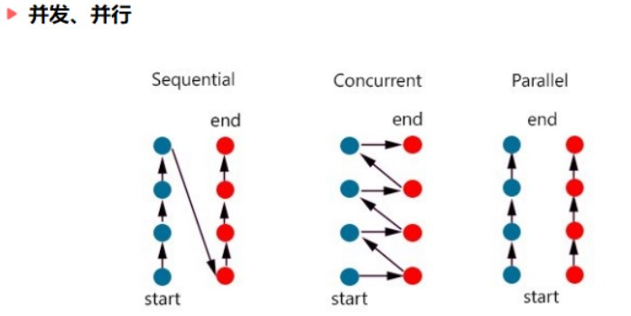

**并发**通常应用于 **I/O 操作频繁**的场景，**并行**则更多应用于 **CPU heavy** 的场景。
**并发(concurrency)**，指同一时刻只能有一条指令执行，多个线程的对应的指令被快速轮换地执行，线程/任务之间会互相切换。
a. 处理器先执行线程 A 的指令一段时间，再执行线程 B 的指令一段时间，再切回到线程 A，快速轮换地执行。
b. 处理器切换过程中会进行上下文的切换操作，进行多个线程之间切换和执行，这个切换过程非常快，使得在宏观上看起来多个线程在同时运行。
c. 每个线程的执行会占用这个处理器一个时间片段，同一时刻，其实只有一个线程在执行。

**并行（parallel）** ,指同一时刻，有多条指令在多个处理器上同时执行
a. 不论是从宏观上还是微观上，多个线程都是在同一时刻一起执行的。
b. 并行只能在多处理器系统中存在，如果只有一个核就不可能实现并行。并发在单处理器和多处理器系统中都是可以存在的，一个核就可以实现并发。注意：具体是并发还是并行取决于操作系统的调度。

**多线程使用场景**
多线程/多进程是解决并发问题的经典模型之一。
<b class="danger">在一个程序进程中，有一些操作是比较耗时或者需要等待的，比如等待数据库的查询结果的返回，等待网页结果的响应。这个线程在等待的过程中，处理器是可以执行其他的操作的，从而从整体上提高执行效率。</b>

比如网络爬虫，在向服务器发起请求之后，有一段时间必须要等待服务器的响应返回，这种任务属于IO 密集型任务。对于这种任务，启用多线程可以在某个线程等待的过程中去处理其他的任务，从而提高整体的爬取效率。

还有一种任务叫作计算密集型任务，或者称为CPU 密集型任务。任务的运行一直需要处理器的参与。如果使用多线程，一个处理器从一个计算密集型任务切换到另一个计算密集型任务，处理器依然不会停下来，并不会节省总体的时间，如果线程数目过多，进程上下文切换会占用大量的资源，整体效率会变低。

所以，如果**任务不全是计算密集型任务，我们可以使用多线程来提高程序整体的执行效率**。尤其对于网络爬虫这种 IO 密集型任务来说，使用多线程会大大提高程序整体的爬取效率，多线程只适合IO 密集型任务。


**程序在运行时一次只能执行一个任务（单线程）**，让程序同时执行多个任务就要使用多线程技术。
1. 程序进入执行状态后就是一个进程，每个进程有自己的独立的内存空间、系统资源，每一个进程的内部数据和状态都是完全独立的。windows中的进程局势exe或者dll程序，进程之间相互独立也可以通信。
2. 一个进程中可以包含多个线程，多个线程共享一块内存空间和一组系统资源，所以系统在各线程之间切换时，系统开销比进程小得多，因此线程称为轻量级进程。
3. python程序至少有一个线程即主线程，python程序启动后由python解释器负责创建主线程，程序结束后由python解释器停止主线程。多线程中，主线程负责其他子线程的调度，启动、挂起、停止等。多线程编程时，需要给每个子线程执行分配机会，通过让当前子线程休眠暂停 <b class="danger">（延迟当前子线程的后续执行）执行</b> ，让其他线程有机会执行。如果当前子线程没有休眠，只能等待当前线程执行后再执行第二个线程。

多线程可以把空闲时间利用起来，比如有两个进程函数 func1、func2，func1函数里使用sleep休眠一定时间，如果使用单线程调用这两个函数，那么会顺序执行这两个函数，也就是直到第一个函数执行完后，才会执行第二个函数，这样需要很长时间；如果使用多线程，会发现这两个函数是同时执行的，这是因为多线程会把空闲的时间利用起来，在第一个函数休眠的函数就开始执行第二个函数

python多线程使用场景：如果程序时cpu密集型的，使用python的多线程是无法提升效率的，如果程序时IO密集型的，使用python多线程可以提高程序的整体效率。

CPU密集型（CPU-bound）：CPU密集型也叫计算密集型，指的是系统的硬盘、内存性能相对CPU要好很多，此时，系统运作大部分的状况是CPU Loading 100%，CPU要读/写I/O(硬盘/内存)，I/O在很短的时间就可以完成，而CPU还有许多运算要处理，CPU Loading很高

IO密集型（I/O bound）：IO密集型指的是系统的CPU性能相对硬盘、内存要好很多，此时，系统运作，大部分的状况是CPU在等I/O (硬盘/内存) 的读/写操作，此时CPU Loading并不高，I/O bound的程序一般在达到性能极限时，CPU占用率仍然较低。这可能是因为任务本身需要大量I/O操作，而pipeline做得不是很好，没有充分利用处理器能力

多线程的应用有很多，一些阻塞主线程的操作应该被放到子线程中处理，比如打开文件，网络爬虫。多线程会产生并发问题，多个线程如果同时读取某个变量导致相互干扰产生并发问题，所以实际开发中尽量避免多个线程读取或写入相同的变量。
```python 
import _thread as thread
from time import sleep, ctime

def fun1():
    print('开始运行func1', ctime())
    # 休眠4秒
    sleep(4)
    print('func1运行结束', ctime())
def fun2():
    print('开始运行func2', ctime())
    # 休眠4秒
    sleep(2)
    print('func2运行结束', ctime())
def main():
    print('开始运行时间', ctime())
    # 启动一个线程运行func1函数
    thread.start_new_thread(fun1, ())
    thread.start_new_thread(fun2, ())
    # 休眠6秒
    sleep(6)
    print('运行结束时间', ctime())

if __name__ == '__main__':
    main()

E:\python\python.exe E:/progect/untitled1/untitled1/urls.py
开始运行时间 Sat Feb 16 09:34:00 2019
开始运行func1 Sat Feb 16 09:34:00 2019
开始运行func2 Sat Feb 16 09:34:00 2019
func2运行结束 Sat Feb 16 09:34:02 2019
func1运行结束 Sat Feb 16 09:34:04 2019
运行结束时间 Sat Feb 16 09:34:06 2019
```


#### 线程模块 threading ，线程类Thread
线程模块相关函数：
```python 
avtive_count() #返回当前处于活动状态的线程个数
current_thread() #返回当前的Thread对象
main_thread() #返回主线程对象，主线程是python解释器启动的线程

import threading
threading.current_thread()
threading.active_count()
threading.main_thread()
```

创建子线程
1. 线程对象，由threading模块的Thread类或Thread的子类构建的对象
2. 线程体，即子线程要执行的代码，通常封装到一个函数中。子线程启动后会执行线程提。
实现线程体有以下两种方式

a. 自定义函数中实现线程体
`Thread(target=fnName, name='threadname', args=[x1,x2])`
target参数指向自定义的线程体函数
name参数可自定义线程名称
args为线程体函数提供的参数，列表类型
示例
```python 
import threading
t1 = threading.Thread(target=Fn1, name ='myThread')
t1.start()
```
b. 自定义线程类实现线程体，run()方法就是线程体函数
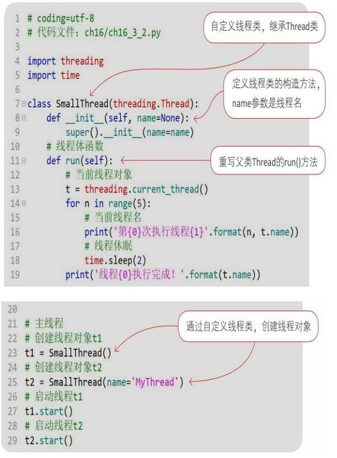

## 线程管理
1. 等待线程结束，某些场景可以控制主线程等待另一个子线程t1执行结束后才能继续执行
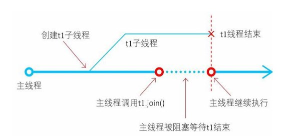
join(timeout= None) #设置超时时间单位秒，不设置默认一直等待，调用join()方法让主进程阻塞，等待t1子进程执行完毕后再继续执行。

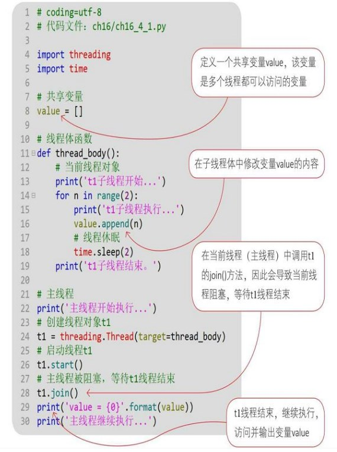

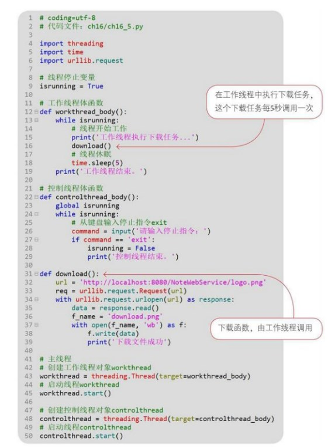

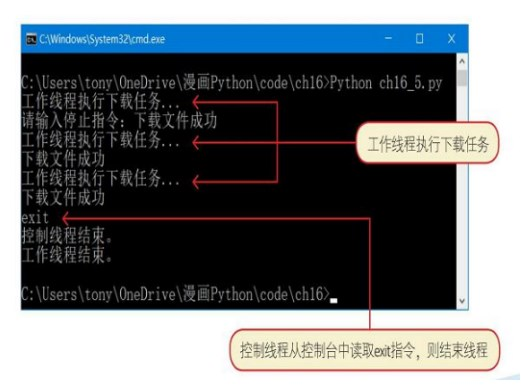


## python GIL
由于 Python 中 GIL 的限制，导致**不论是在单核还是多核条件下，在同一时刻只能运行一个线程，导致Python 多线程无法发挥多核并行的优势**。GIL 全称为 Global Interpreter Lock（全局解释器锁)，是Python 解释器 CPython 中的一个技术术语，是Python之父为了数据安全而设计的。

在 Python 多线程下，每个线程轮流执行:
获取 GIL-->执行对应线程的代码-->释放GIL
**某个线程想要执行，必须先拿到 GIL**，并且在一个 Python 进程中，GIL 只有一个，导致即使在多核的条件下，同一时刻也只能执行一个线程。每一个线程执行完一段后，会释放 GIL，以允许别的线程开始利用资源。
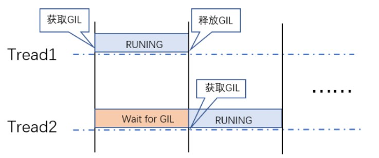
Python 由于GIL锁的存在，无法利用多进程的优势，要真正利用多核，可以重写一个不带GIL的解释器， 比如JPython（Java 实现的 Python 解释器）。某些Python 库使用C语言实现，例如 NumPy 库不受 GIL 的影响。在实际工作中，如果对性能要求很高，可以使用C++ 实现，然后再提供 Python 的调用接口。另外Java语言也没有GIL限制。


## python常见命令
```shell
cls #清屏幕
pip install packageName
pip uninstall packageName
pip #查看帮助
help(round) #查看某个函数的使用方法
import this #查看python之禅
```

## python常用全局函数
`id(var1)` 显示变量在内存中的位置
`dir(obj)` **列表形式**返回当前模块下的**所有变量**，包含内置变量，dir(sys)返回sys包的所有变量组成的数组
1. 操作相关函数
```python 
print(obj,end='|')
a=input()
exec('print(''Python'')') #执行python语句
eval('1+1') #执行一个表达式
type(obj)
id(obj) #返回某个obj对象的唯一标识
globals() #返回全局变量的字典
help()
isinstance('a', str) #判断一个对象是否为某个类的实例
issubclass(class1,class2) #判断一个类是否为另一个类的子类
```

2. 数学函数
```python 
len(a)
max(a)
min(a)
round(1.123, 2)
abs()
sum()
sorted(lis) #排序，返回被排序后的list
reverse(iterate) #返回可迭代对象的反转
divmod(a,b) #获取a除以b的商和余数
pow(a，b) #a的b次方
range(num1,num2, step)
```

3. 类型转换
```python 
str('a') #等同于 js toString(var)
int(1.0)
float(a)
bool(1)
tuple(iterate) #可迭代对象转换成tuple
list(iterate) #可迭代对象转换成list
dict(iterate) #可迭代对象转换成dict
set(iterate) #可迭代对象转换成set
iter(iterable) #返回一个可迭代的对象
enumerate(iterable) #返回一个枚举对象
hex(int) 转16进制
oct(int) 转8进制
bin(int) 转2进制
chr(int) 转数字为ASCII字符
ord(str) 转字符为ASCII编码
```

 ## python对象的方法
 1. random
```python 
import random
random.random() #生成0--1之间的随机浮点数
random.randint(a,b) #生成a,b之间的随机整数
random.choice(list) #对有序数列随机取样（list, tuple,str）
random.sample(list, 5) # 对有序数列随机取片段（对list,随机取5个元素）
random.shuffle(list) #随机打乱有序数列
```

2. time
```python 
import time
time.sleep(1) #间隔1秒休息一次
time.ctime() #生成本地时区时间
time.localtime() #生成本地时间的时间结构
time.strftime('%Y-%m-%d %H:%M:%S', time.localtime()) #格式化时间
```

3.string
```python 
str.format()
f'str{}'
str.isnumeric() #判断是否为可计数类型,一二三也会返回True
str.isdigit() #判断是否为数值类型，一二三会返回Fals
str.split(',') #以什么分割字符串为列表
str.strip() #去除空格
```
4. list
```python 
list1.copy()
list1.deepcopy()
```

5. dict
```python 
dic.get('key')
dic.keys()
dic.values()
dic.items()
dict.fromkeys(lis, val) #根据lis生成一个dict,key为lis成员，用val填充
dict(data) # 转data为字典格式，data的数据是列表[key, value]格式才行
```


## python数据读写
csv是有分隔符的text文件
路径的书写三种方式
`path1 =C:\\Users\\Administrator\\Downloads\\text.txt`
`path2 = C:/Users/Administrator/Downloads\\text.txt`
`path = r'C:\\Users\\Administrator\\Downloads\\text.txt'`

#### 处理文件路径模块os
```python 
import os
os.name #系统类型
os.getcwd() #当前运行脚本的绝对路径
os.listdir() #返回当前脚本所在目录下的所有文件
os.chdir('c:\\abc') #切换路径到c:\abc下
os.remove('c:\\text.txt') #删除文件
os.rmdir('c:\\abc') #删除文件夹
os.path.split('c:\\user\\text.txt') #将文件路径转成元素tuple('c:\\user', 'text.txt')
os.path.exists('c:\\user\\text.txt') #判断文件是否存在，也可以判断文件夹是否存在
```

##### 1. 读取文件
```python 
open(路径, 模式, 编码格式),
模式r读取，w写入，rw读写，a追加，w+打开并清空，wb 二进制模式写入，
file = open(path1, 'r', encoding='utf8')
file.read(10) #读取10个字符
file.readline() #读取行
file.readline(5) #读取行的前5个字符
file.readlines() #读取所有行，并转成列表
file.seek(0) #上一次读取完后将光标移动到开始位置，便于下次读取
file.close()
```

##### 2. 写入文件
```python 
file = open('text.txt', 'w', encoding='utf8')
file.write('abcd')
file.close()

file.writelines(list) #列表list的成员依次传入writelines方法，水平书写，如果希望换行书写则遍历list在每个成员后 + '\n'
```

##### 3. pickle存储
可将数据处理过程中的任何类型数据格式保存为系统中的dump快照文件，**不像写入txt文件时会将原来数据格式转换为字符串**，pickle模块保存的dump快照文件保留的原有的数据类型。
```python 
#将数据保存为快照文件
import pickle
data = {'a':1,'b':[1,2,3], 'c':'hello world'}
dump_file = open('data.pkl', 'wb') #创建文件名为data.pkl的快照文件，写入模式
pickle.dump(data, dump_file)
dump_file.close()

#读取快照文件，还原数据
dump_file = open('c:\\user\\data.pkl', 'rb')
dt1 = pickle.load(dump_file)
print(dt1)
```


## 安装pip
1. 在Python官网上下载Windows版本pip安装包
https://pypi.org/project/pip/#downloads
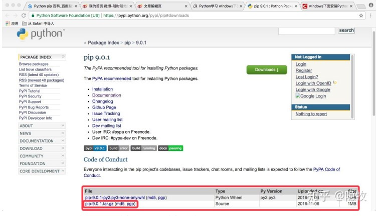
下载完成后，将得到一个压缩包，将压缩包进行解压。

2. 打开控制台，使用cd命令进入解压后的文件夹至可执行目录，如下图所示
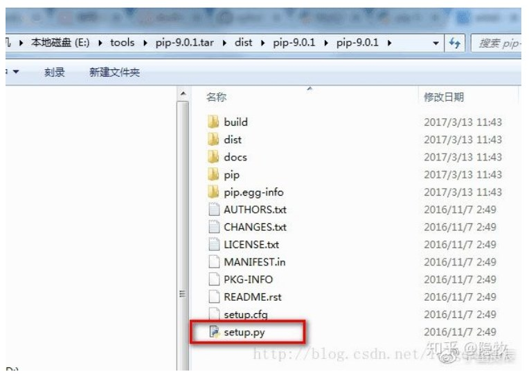

3. 在控制台输入如下命令：
`python setup.py install`
回车，控制台将自动安装pip，安装完成后，在控制台输入
`python -m pip --version`命令
如果显示‘pip’不是内部命令，也不是可运行的程序，说明，缺少环境变量。
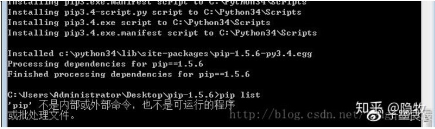
在此，需要在系统环境变量PATH中添加环境变量：C:\Python27\Scripts（本次安装的是Python2.7.10版本，所以需要添加环境变量C:\Python27\Scripts）;添加完成后，再次执行
`python -m pip --version`  命令，如果控制台输出pip的版本号，说明安装成功。

## pip python包管理工具
在cmd命令行环境下安装包
```shell 
 pip install packName
 pip install packName[numpy,scipy] #安装包，同时安装包的依赖项
 pip install packName ==1.2 #指定安装版本
 pip install --upgrade packName #升级已安装的包
 pip install --no-dependencies packName #安装包，忽略包的依赖
 pip install /path/to/packName #安装本地指定目录的包
 pip uninstall packName
 pip list #列出当前python环境已安装的所有包或库
 pip show packName #列出指定包的详细信息
 pip search packName #在python package index 上查找包的信息
 pip #查看帮助
 pip freeze > requirements.txt #导出依赖库，生成依赖包列表文件
 pip install -r requirements.txt #根据导出的依赖包列表文件，安装依赖包
 pip install pipreqs #依赖包管理模块
 pipreqs ./ #导出当前项目目录下所依赖的包
 pip cache purge
```


## Numpy 科学计算工具包
强大的N维数组对象，重点对二维数组结果进行运算（不用遍历循环），包含随机数，线性代数，傅里叶变化等功能。
```python 
import numpy as np
ar = np.array([[1,2,3],[2,3,4]])
np.ndim #数组维度
```
一维数组：单行
二维数组：多行多列
三维数组：多个二维数组构成一个三维数组
四维数组：多个三维数组构成一个四维数组
创建数组时指定的行列个数不一样时，会自动转换成一维数组

#### numpy常用方法
```python 
ar = numpy.array([1,2,3])  #生成数组
ar.ndim #数组维度的个数，轴数，或者说秧，维度的数量也称rank
ar.shape #数组的行列个数
ar.size #数组元素的总个数，n行m列元素个数是n*m
ar.dtype 查看数组中元素的类型，python中的type()函数查看的是数组变量的类型
ar.itemsize 数组中每个元素的字节长度，int32 类型是4字节，float类型是8字节
ar 查看数组详情

#创建数组
ar0 = numpy.array([1,2,3,4,5,6,7,8,9])
ar1 = numpy.array(range(10))
ar2 = numpy.arange(10)  numpy自带生成数组的方法
ar3 = numpy.random.rand(10),reshape(2,5) #创建10个随机数，2行5列
ar4 = numpy.linspace(10, 21, num=20, endpoint= True, retstep=True) #生成10-21之间的数据，均分成20个，endpoint参数指定是否包含最后一个边界数，retstep是否显示步长
ar5 = numpy.zeros(10) 创建长度为10的数组，用0填充，ones(10)方法类似
ar6=numpy.zeros((2*5), dtype=numpy.float) 创建2行5列，用0填充的数组，元素为浮点数，ones((2*5), dtype=numpy.int)方法类似
ar7 = numpy.zeros_like(ar3) 创建一个数组ar7 复制ar3的数组结构，ones_like(ar3)方法类似
ar8 = numpy.eye(5) #创建一个正方形n*n的单位矩阵，对角线值为1，其余数为0
```


----
<span class="success">
    test asdfds adasf dfas 
</span>

<span class="alert danger">
    test asdfds adasf dfas 
</span>

<span class="alert info">
    test asdfds adasf dfas 
</span>


<span class="alert success">
    test asdfds adasf dfas 
</span>

<div class="alert warning">python不区分单精度和双精度浮点
数，默认双精度，int也不细分short,long整型)
</div>

<div class="alert asso">python不区分单精度和双精度浮点
数，默认双精度，int也不细分short,long整型)
</div>

<div class="alert doubt">python不区分单精度和双精度浮点
数，默认双精度，int也不细分short,long整型)
</div>


