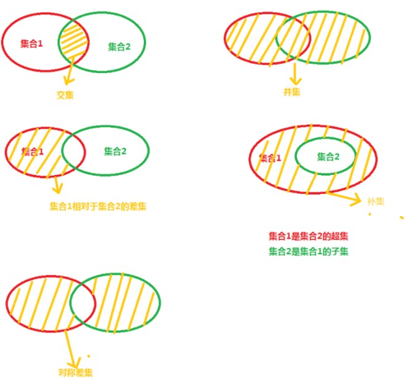

<style>

    .success {
        padding:5px;
        display:inline;
        color:#1B5E20;
        background-color:#C8E6C9;
    }
    .warning {
        padding:5px;
        display:inline;
        color:#E65100;
        background-color:#FFE0B2;
        width:100%;
    }
    .danger {
        padding:5px;
        display:inline;
        color:#B71C1C;
        background-color:#FFCDD2;
    }
    .info {
        padding:5px;
        display:inline;
        color:#006064;
        background-color:#B2EBF2;
    }
    .doubt {
        padding:5px;
        display:inline;
        color:#AAA;
        background-color:#DDDDDD;
    }
    .asso {
        padding:5px;
        display:inline;
        color:#555;
        background-color:#FFCC00;        
    }
    
    .alert {
        display:inline-block;
        width:100%;
        padding:5px;
        line-height:30px;
        margin-top:10px;
    }
</style>


# Learn-Python
Learn-Python
#### python缺点
相对于编译型语言（c,c++），python和javascript一样属于解释型语言，速度慢。python的运行效率低，但开发效率高。


## 基本数据类型
### 1. Number
数字类型(大的分类，下面还有整数int，浮点数float, 布尔类型bool（python中**bool类型属于Number类型的子类**），复数类型（数字j）等子分类.
<span class="danger"><b>python不区分单精度和双精度浮点数，默认双精度，int也不细分short,long整型</b></span>
```python
>>> type(1*1) // class 'int'
>>> type(1*1.0) // class 'float'
>>> type(1/1) // class 'float' 两个整型相除结果类型为浮点数
>>> type(1//1) //class 'int' 两个整型用双斜杠//相除结果类型为整型
```
<b class="danger">单斜杠</b> 除法自动转换结果为<b class="danger">浮点数</b>，<b class="danger">双斜杠</b>除法是整除<b class="danger">不考虑余数</b>

<span class="asso"><b>JS: Math.floor()  ,Math.ceil()   ,Math.round()   ,ParsrInt()</b></span>
<b class="asso">JS: typeof(134) </b>


### 2. 进制转换 10，2，8，16进制

2进制（满2进1）：0,1, 10
8进制（满8进1）：0,1,2,3,4,5,6,7, 10
10进制（满10进1）：0,1,2,3,4,5,6,7,8,9, 10
16进制（满16进1）0,1,2,3,4,5,6,7,8,9,A,B,C,D,E,F, 10
**进制类型，数据的记录方式**
2进制：0，1，0，1，0，1 1+1= 10
8进制：0，1，2，3，4，5，6，7，10，11
10进制：0，1，2，3，4，5，6，7，8，9，10
16进制：0,1,2,3,4,5,6,7,8,9,A,B,C,D,E,F,10
**python进制表示方法及转换**
2进制(binary)：0b10, 2进制转10进制，2进制的10，在IDLE中会自动转换成10进制数，结果为2
8进制(octal)：0o10, 8进制转10进制，8进制的10，在IDLE中会自动转换成10进制数，8
16进制(hex)：0x10, 16进制转10进制，16进制的10，在IDLE中会自动转换成10进制数，16
bin() 转换成2进制数方法
bin(10), bin(0x12), bin(0o10)
int() 转换成10进制数方法
int('123') //123
int(123) // 123
<b class="danger"> int(123.01) //返回错误 </b>
hex() 转换成16进制方法
oct() 转换成8进制方法
float() 转成浮点数
js:parseInt('123'), parseFloat('123.2')


### 3. bool 布尔类型
<b class="asso">
JS: Boolean()
</b>

```python
type(True) #class 'bool'
type(False) #class 'bool'
int(True) # 1
int(False) # 0
bool(1) #True
bool(0) #False
bool(2) #True
bool(0b01) #Ture
bool(0b0) #False
bool('abc') #True
bool('') #False
bool([1,2,3]) #True 列表
bool([]) #False 这里不同于JS的空数组,JS空数组Boolean([])为true
bool({1,2,3}) #True 元组
bool({}) #False
bool(None) #False
```

<b class="asso">
js:Boolean('123')
js:true,flase python:True,False
js数组，python列表；js:对象，python元组
</b>

### 4. str 字符串类型
单引号 'this is a apple'
双引号 " it's a apple "
**三引号表示多行字符串，单或双都可以**

```python
"""
hello world
hello world
"""
```

`print('hello world\nhello world') `
print函数加转义字符实际也会显示成两行 hello world<b class="danger">\n</b> hello world

`print(r'c:\na1\na2') `
字符串前面加r print(<b class="danger">r</b>'String')表示的是原始字符串（所见即所得）

转义字符：换行\n, 单引号\', 制表符\t


#### 4.1 字符串运算
`'hello world'[0] ` 取字符串第0个字符
`'hello world'[0:4]`  取字符串0到4个字符串，不包含第4个
`'hello world'[6: ]`   <b class="danger"> [6: ]</b> 从第6位截取到末尾，返回world。省略即开始或末尾
`'hello world'[:-4]`  <b class="danger"> [:-4]</b> 从0位开始**往后截取**到负4位，返回'hello w'。省略即开始或末尾
`'hello world'[-4:]`  从倒数第4位开始**往后截取**，返回'orld'
<b class="asso">JS:substring(0,4)</b>
**python中字符串也是有序数据类型**
**string是不可变的序列，常用操作方法:**

```python
.replace('a','b', n) #将字符串中的a替换成b, 修改n个匹配的字符
.translate()#将字符串中的每个字符根据指定的映射表进行转换。比replace方法更灵活。
.split(',') #将字符串以','分割转换成list
js:'abcde'.split('')
.join(str1) #将List转换成字符串 '-'.join(list)
js:['a','b','c','d'].join('-')
.splitlines() #将字符串按行分割，并返回一个包含每行作为元素的列表
.center(),.ljust(),.rjust() #使用指定的字符填充出指定长度的字符串，原字符串居中或左对齐或右
对齐
.zfill() #用0左填充出指定长度的字符串
.startwith('a') #是否以a开头
.endwith('a') #是否以a结尾
.upper() #全大写
.lower() #全小写
.capitalize() #首字母大写
.title() #每个单词首字母大写
.swapcase() #大小写互换
.isnumberic() #是否全为数字
.isalpha() #字符是否全为字母
.strip() #删除字符串头尾指定字符（默认为空格），返回新字符串
.rstrip() #删除字符串右侧空格
.lstrip() #删除字符串左侧空格
.find() #查找指定内容在字符串中出现的索引号，找不到返回-1
.expandtabs() #将字符串中的制表符\t转换城指定数量的空格字符
\ 转义字符，\n 换行, \\ 斜线
```

#### 4.2 格式化字符串
<b class="danger">
.format()方法格式化字符串，{n}中可以指定传入参数的索引号，可以指定变量名称
</b>

```python
1 print("{}{}{}".format('a','b','c')) #abc
2 print("{0}{0}{2}{2}".format('a','b','c')) #aacc {}指定索引号占位符
3 print("hello {}".format("world")) #hello world
4 print("hello {var}".format(var="hello")) #hello hello {}中指定变量名var
5 print("number is {:d}".format(2)) #number is 2 指定整型数值占位符
6 print("string is {:s}".format('str1')) #string is str1 指定字符串占位符
7 print("float number is {:.2f}".format(12.50)) #float number is 12.50 指定两位小数浮点数占位
8 print("float number is {:.0f}".format(12.50)) #float number is 12 指定小数四舍五入占位符
9 print("secince number is {:.4E}".format(121234123123)) #secince number is 1.2123E+11 指定
10 print("number is {:.2f}%".format(45.23)) #number is 45.23% 加%自动转换成百分比
```

<b class="danger">
f-string() 模板字符串
</b>

```python
1 >>> num = 2
2 >>> f"I have {num} apples"
3 >>> f"They have {2+5*2} apples"
4 'They have 12 apples'
5 >>> import math
6 >>> f"Π的值为{math.pi}"
7 'Π的值为3.141592653589793'
```


#### 4.3 字符编码
计算机以统一的方式存储和处理字符，无论是字母、数字、符号还是特殊字符。**字符编码通常是将字符集中每个字符映射为一个或多个字节(binary digits)**

常见的字符编码包括：
**ASCII 美国信息交换标准代码**，包含**128**个字符，英文大写小写，数字，标点，控制字符。每个字符对应**一个字节**长度**8bit**

**unicode 统一字符编码**，将世界各种语言的**每个字符定义一个唯一的编码**，以满足跨语言、跨平台的文本信息转换。unicode通常**使用一个特定**的编码方案来实现，最常见的unicode编码方案就是**UTF-8**。常见的\u是unicode转义序列。

**UTF-8** 可变长度编码方式，UTF-8 就是在互联网上使用最广的一种 Unicode 的实现方式，占用**1-4**个字节

**UTF-16**占用**2-4**个字节

**UTF-32**始终占用**4**个字节

**GBK**

```python
1 text='你好，123abcde'
2 encode_text = text.encode('utf-8') #将字符串用utf-8格式编码
3 decode_text = encode_text.decode('utf-8') #用utf-8格式解码字符串
4 text2 = text1.encode('ascii', error='ignore') #忽略无法处理的字符
5 text3 = text1.encode('ascii', error='replace') #用?代替无法处理的字符
6 with codecs.open('./text.txt', encoding='utf-8') as file #codecs包读取text.txt文件，用utf-8编码方式打开
```

unicode字符串，Unicode字符串通常用于表示包含非ASCII字符的字符串，比如中文或者特殊符号。Unicode字符串表示的是字符串本身，而不是它们的编码形式
unicode字符串 `print(u'你好，python')`

二进制字符串 `print(b'hello,python')`  *这里不能有中文*

### 5. list列表类型  python中的有序数据类型
<b class="asso">
JS: Array
</b>

List:`[1,2,2,1,'hello','abc',12.5, [2,3,22]]`
list是有序的，而且可以嵌套list, List可以通过赋值改变成员的值

#### 访问列表
List[0] 返回列表的第0个元素
如果索引号是单个数字则返回结果是List成员的字符串
如果索引号是一个区间值List<b class="danger">[0:4]</b>返回列表的第0到第4个元素(不含第4个)组成的<b class="danger">新列表</b>

#### 连接两个列表 <b class="asso">JS: concat方法</b>
`[1,2,3,4] + ['a','a1','aa'] #返回 [1,2,3,4,'a','a1','aa'] `
 

#### 重复列表
`[1,2] * 3 #返回 [1,2,1,2,1,2]`

#### 列表list的常用方法
```python
.append() #添加元素，改变原列表(如果参数是列表则会将参数当成一个元素插入)
.extend() #添加元素，改变原列表(如果参数是列表则会挨个插入)
+ #不改变原列表但生成一个新的列表
.remove(2) #删除指定的元素，第一个匹配的元素被删除
.clear() #清空列表
del list[0] #del是语句，删除列表list指定索引号的元素，参数可以指定区间，可以指定步长
del list[1:6:3] #del是语句，删除列表list从第1个开始到第6个，间隔3个删除
.insert(2,'hello') #在指定位置插入元素
tuple(list1) #tuple函数，转换list为tuple
tuple(range(10)) #tuple函数，转换range为tuple
list(tuple1) #list函数，转换tuple为list
list(range(10)) #list函数，转换range为list

.sort() #列表的排序，默认升序，不会生成新列表仅修改原列表
.sorted(x) #排序并复制，对x做排序生成新的经过排序后的列表
1 x1=[2,3,4,5,6]
2 x2=['d','c','a','b']
3 x1.sort(reverse=True) #reverse反向排列，[6,5,4,3,2]
4 x2.sort() #默认升序排列 ['a','b','c','d']
5
6 x1=[6,7,8,9]
7 x2=sorted(x1, reverse=True) # sorted(x1) 会生成一个经过排序后的新列表
8 x3=x1.sort(reverse=True) # .sort()方法排序修改原列表，不会生成新列表，所以x3是none
9 print(x1,x2,x3) # [9, 8, 7, 6] [9, 8, 7, 6] None

```
.sort() #列表的排序，默认升序，**不会生成新列表**仅修改原列表
.sorted(x) #排序并复制，对x做排序**生成新的**经过排序后的列表


### 6. tuple元组类型  python中的有序数据类型
Tuple: `(1,2,3,4,'hello')` 元组是<b class="danger">不可变的List</b>,即元组的<b class="danger">元素不可以赋值</b>。<b class="danger">列表有的方法元组也有</b>

【1】定义只有一个元素的元组`type((1, ))`返回**tuple**。如果不加逗号是(1)则python编译器默认(1)是求值运算。
【2】定义空的元组`type(tuple())` 返回tuple，定义空的元组 type(())


<b class="danger">序列包含可变序列List, 和不可变序列Tuple，字符串String</b>，序列的特点类似JS中复杂类型的变量在内存中的特点，属于值地址引用。栈内存中存放的是堆内存中的内存地址。

#### 字符串、列表、元组共有的方法
【1】切片[0:10:2] 切片方法的 <b class="danger">第三个参数是步长</b>
【2】连接[1]+[2]
【3】判断元素是否**在序列内** 
2 **in** [1,2,3] 返回True 
<b class="asso">JS: [1,2,3].includes(2)</b>

判断是否**不在序列内** 
2 **not in** [1,2,3] 返回False
【4】序列的长度 **len(**[1,2,3]**)**，len('hello world')，len((2,))
【5】序列的最大值,最小值 **max(**[1,2,3]**)**，**min(**(1,2)**)** ,
**max(**'hello world'**)** 字符串最大值、最小值是字符串ASCII编码的最大值，最小值。ord('param') 转换参数为ASCII编码，参数必须为**单个字符**
【6】序列的 **方法** 使用 **.()** 调用
```python
1 x=[1,2,3,2,8,2,7,5,2]
2 print(x.index(5)) #序列的方法，指定元素，第一个匹配上的，在序列中的序号
3 print(x.count(2)) #序列的方法，指定元素，第一个匹配上的在序列中出现的次数
```
#### 序列的切片和步长 <b class="danger">适用list, tuple, string</b>
```python
1 x=[1,2,3,4,5,6,7,8,9]
2 print(x[2:5]) #返回索引2-5的值，不包含第5个值
3 print(x[:5]) #从第0个值截至到第5位，不包含第5个值
4 print(x[2:]) #从第2个开始到最后一个值
5 print(x[:-1]) #从第0个值到最后一个值
7 [3, 4, 5]
8 [1, 2, 3, 4, 5]
9 [3, 4, 5, 6, 7, 8, 9]
10 [1, 2, 3, 4, 5, 6, 7, 8]
11
12 x=[1,2,3,4,5,6,7,8,9,'hello','world']
13 print(x[2:9:2]) #第2个到第9个不包含9之间的，每两个间隔取值
14 print(x[1:10:3]) #第1个到第10个不包含10之间的，每3个间隔取值
16 [3, 5, 7, 9]
17 [2, 5, 8]

```

#### 使用<b class="danger">.copy()</b>方法可<b class="danger">浅拷贝</b>成两个独立的序列


### 7. set集合类型 python中的无序数据类型

集合是<b class="danger">无序的</b>数据类型，无法通过下标序列号获取元素。集合的元素是<b class="danger">没有重复的</b>set适用于需要**存储一组唯一元素**并进行**集合**运算的场景
<b class="asso">JS:js中的set()无重复，但js中的set是有序的。</b>
set: {1,2,3,4,'123',True}，定义空的集合 type(**set()**)
获取集合的长度 **len(**{1,2,3}**)**
判断是否在集合内 1 **in** {1,2,3}
判断是否不在集合内 1 **not in** {1,2,3}
求两个集合的**差集**，用**减法-**，{1,2,3,4,5,6} **-** {3,4} 返回{1,2,5,6}
求两个集合的**交集∩**，共有的元素，**用&** ，{1,2,3,4,5,6} & {3,4} 返回{3,4}
求两个集合的**并集∪**，**用 |**，{1,2,3,4,5,6} **|** {5,6,7} //返回{1,2,3,4,5,6,7}


### 8. dict字典类型 python中的无序数据类型
dict: { 'a':100, 'b':'hello' } dict是**无序列表** dict适用于需要通过**唯一的键**来查找、存储和操作值的场景，例如存储联系人的姓名和电话号码。
<b class="asso">JS:js中的Object对象</b>
字典中不能有重复的key，存在重复的key时，后添加的key会替代先添加的key。
字典的键key可以是字符串也可以是数值,{**1**:'a',**'1'**:'b'} ，这里**两个key1是不同的key**
字典的**key 必须是不可变的类型**，比如int, str,tuple，list可变所以不能作为key
获取key对应的value值 {'a':1,'b':2}**['a']**
定义空的字典type(**dict()**)

#### 字典的常用方法
dic1**.update**(dic2) #合并字典，**会改变dic1**
dic3 = dic1 **.copy()** #浅复制一个字典
a1 = **len(** dic3 **)** #返回字典长度
'a' **in** dic1 #判断key是否在某个字典中
`lst1 = [['a',1],['b',2]]` `dict1 = dict(lst1)` #将嵌套数组lst1转成key,value格式
`dict([('a',1),('b',2)])` #将数组嵌套的元组转成key,value格式
`keys1=['a','b','c']` `dic1 = dict.fromkeys(keys1,0)` #生成**值为0**只有键名的字典，fromkeys方法的第二个参数是，填充生成字典的值
dic1 **.get('key')** #获取字典key对应的value
dic1 **.keys()** #获取dic1的所有的key
dic1 **.values()** #获取dic1的所有的value
dic1 **.items()** #获取dic1的所有的key,value构成的成员，返回结果的格式是 **[(** 'key','value' **)]**

#### 遍历字典
```python
1 for keys in dic1: #遍历dic1的keys
2 print(keys)
3
4 for values in dic1.values(): #遍历dic1的values
5 print(values)
6 
7 for (k,v) in dic1.items(): #遍历dic1的key,value 键值对
8 print(k,v)
```

## python变量
值类型 **(不可变)：int，str，tuple，**即便是str[0]='aa' 这种对字符串的操作也不能改变字符串str原来的值。
<b class="asso">JS:'string'[0]=1 无效</b>

引用类型**（可变）：list，set，dict** 引用类型的成员的值可以改变。`[1,2][0]='a'`
<b class="danger">id(var) 可以显示一个变量在内存中的地址</b>


tuple类型不能修改成员，也不能追加成员。tuple的使用场景主要是描述保持不变的数组类型的数据。
但在**tuple**类型中，**嵌入了可变数据类型**的成员，则这个**可变类型的成员是可以被修改的**
```python
1 a = (1,2,3,[1,2,4])
2 a[3][2]='4'
3 #返回(1,2,3,[1,2,'4'])
4 a[3].append('d')
5 #返回(1,2,3,[1,2,'4','d'])
```
user_account = <b class="danger">input()</b> 命令行输入时，使用input()函数

python中没有常量概念，**只有形式上的常量，变量名使用大写**，python文件的顶部，一般有一段注,用来说明该文件模块的内容。


## 运算符
算术运算符： `+， - ，*，/，**， //, %`
赋值运算符： `+=，-=， *=， /=， %=， **=，//=`
比较运算符：`==，!=， >=， <=， >， <`
逻辑运算符：`and， or，not  `<b class="asso"> JS: &&, ||, !</b>
成员运算符： `in，not in `<b class="asso"> JS: 没有not in 只有in</b>
身份运算符：`is，is not` <b class="asso"> JS: Object.is(param1, param2) 判断两个值是否完全相等即==) </b>
位运算符：&， |， ^，>>，<<，~ （<b class="danger">按位</b> &,|,^,>>,<<,~）
python中没有a ++, a-- 这种自增自减运算符


<b class="danger">比较运算符</b>在比较<b class="danger">字符串</b>的时候会调用<b class="danger">ord()</b>函数，将两个待比较的字符串各自分拆后逐个字符转成ASCII编码来比较。比如判断abc<abe比较时，会先比较a,a，在比较b,b，最后比较c,e

<b class="danger">比较运算符</b>在比较<b class="danger">列表</b>的时候会将两个列表的成员逐一比较，比如判断[1,2,3]<[2,3,4]比较时，会先比较1<2，再比较2<3，最后比较3<4。元组的比较也是类似


逻辑运算符可以比较bool型，数值型，字符串。在python中做逻辑运算时会自动转换数据类型：int、float类型中的0会被转换为False，大于0或小于0的会被转换为True

str类型中，**空字符串**''会被转换成False，注意不是' '(**里面有空格不是空字符串**)

list,tuple,set,dict 类型中，空的列表[],空的元祖(),空的集合{},空的字典{'a':1} 会被转换成False. <b class="asso">JS:这里不同于js中的空数组，js空数据会被转换成true</b>


身份运算符:**is, not is**, 判断的是两个变量的<b class="danger">值和值的值内存地址</b>是否相同
a=1 b=1.0
判断a <b class="danger">==</b> b时返回True，比较运算符判断的是两个值是否相等，不看值的内存地址。
判断a <b class="danger">is</b> b 的时候返回False，身份运算符判断值和值的内存地址是否相等

python中判断一个变量是否是某个类型的实例，使用
<b class="danger">isinstance： isinstance('a', str) #判断'a'是否是str类型</b>
<b class="danger">isinstance: isinstance(param1,(str, tuple, set)) #判断param1是否是str,tuple,set中的任意一种</b>

<span class="asso"><b>JS:判断对象是否是某个构造函数（类）的实例，str instanceof String // 这里str 必须是str = new String('a')的结果，这样才是String函数生成的实例。
</b></span>


#### 运算符优先级
赋值运算是右结合，从等号右边往左执行。如果表达式优先级顺序不太清晰，使用括号显式的标记运算优先级。
**算术运算符>比较运算符>逻辑运算符**


##### 算术运算符
a+b, a-b, a*b, a/b
a%b #取模，求除法余数
a//b #除法取整数
a**b #幂运算，a的b次方

##### 比较运算符

a **==** b
a **>=** b
a **!=** b
a **>** b
a **<** b

##### 逻辑运算符
True **and** False, True **or** False, **not** True

##### 成员运算符
lst = [2,3,4]
dis = {'a':1,'b':2}
print(1 **in** lst) #返回true
print('c' **in** dis) #返回false

##### 身份运算符
a=[1,2,3,4,5]
b=a
c=[1,2,3,4,5]
a is b # True
a is c # False
a is not c # True


## python流程控制语句
python编码规范：
行末尾不强制加分号结尾。不需要用{}包裹代码块，python使用缩进表示代码块
### 1. 条件控制语句 if-else
<b class="danger">pass</b> 语句在python中用来作占位，使语句能顺利执行下去不出错
```python
1 if condition_test:
2   pass
3 elif condition_test2:
4   pass
5 else:
6   pass
```
<b class="asso">JS:if () {} else if () {} else {}</b>
### 2. 循环while else
```python
1 while condition:
2   pass1
3 else:
4   pass2 #else是condition条件为false时执行的代码块

1 count =1
2 while count <=10:
3   count +=1
4   print(count)
5 else:
6   print('EOF')
```
while循环的使用场景是，设定condition为条件判断，condition条件为true时就一直执行语句块，条件判断为<b class="danger">false</b>时就执行<b class="danger">else</b>后面的语句块。while多用在递归的场景中。

<b class="asso">while(){}, do{} while</b>

### 3. 循环for else
for 循环用来遍历/循环 序列、集合、字典

for **target_list in expression_list**:
    pass1
else:
    pass2
<b class="danger">else</b> 语句块在for循环<b class="danger">正常结束</b>（**非break终止**）后执行
```python
1 a = [['a','b','c'],(1,2,3)]
2 for i in a:
3   print(i,end='--')
4   for y in i:
5       print(y,end="|")
6 else:
7   print('EOF iterate done')
```
print(a,<b class="danger">end = '|'</b>)
print函数使用<b class="danger">end参数</b>可以将需要打印的元素横向间隔排列。

### 4.循环控制 终止循环 使用break, continue
break 终止循环跳出整个循环，continue 跳过本次循环但会继续执行下一次循环。<b class="danger">break</b>会<b class="danger">中断</b>for循环遍历，使for循环结束后的else不执行，但<b class="danger">在循环嵌套的场景下，break只会中断所在层级的循环</b>，<b class="danger">对外层循环不会中断</b>
```python
1 a = [1,2,3]
2 for x in a:
3   if (x == 2):
4       break
5   print(x, end='|')
6 else:
7   print('EOF')
8 # x==2时终止循环，整个过程只会打印出1|, break语句终止循环后
```

```python
1 a = [1,2,3]
2 for x in a:
3   if (x == 2):
4       continue
5   print(x, end='|')
6 else:
7   print('EOF')
# x==2时跳过本次循环，整个过程会打印出1|3|EOF
```

#### for循环的范围限定使用range()函数
<b class="asso">JS for 循环：</b>
```js
1 // js文件
2 let a = [1,2,3,4,5,6,7,8,9,10]
3   for (let i =0;i <= a.length; i ++) {
4       console.log(i+'|')
5 }
```

```python
# python文件
1 for i in (range(0,10)):
2   print(i)
3 # 打印出0,1,2,3,4,5,6,7,8,9 共10个数字

1 for i in (range(0,10,2)):
2   print(i)
3 #打印出0，2，4，6，8 共5个数字，range()函数的第三个参数表示步长
```

#### range列表和生成器
**range(num1, num2, length)**
range范围num1是起始数值，num2是终止数值但不包含num2，length是步长，步长可以为负数表示递减。
<b class="danger">range生成一个整数区间,不包含末尾一位，</b>类型为`<class range>`， <b class="danger">range不是一个列表但可以使用索引访问值，使用括号表示range，逗号表示范围,</b> **第三个参数代表步长**。使用 **list()** 函数可以生成由 **range** 指定区间范围的 **列表** ，使用 **tuple()** 可以生成指定范围**元组**，使用 **set()** 可以生成指定范围 **集合**
```python
1 for x in range(10,2,-2):
2   print(x)
3 #结果打印出10，8，6，4

x = range(0,5)
y = tuple(x) #转成元组
y
(0, 1, 2, 3, 4)

y1 = list(x) #转成列表
y1
[0, 1, 2, 3, 4]

y2 = set(x) #转成集合
y2
{0, 1, 2, 3, 4}
```


## python 工程组织结构
### 包、模块、类
python项目的组织结构，最顶级的层级<b class="danger">包</b>层级（类似文件夹），然后是<b class="danger">模块</b>层级（类似文件）、最后是写在模块文件中的<b class="danger">类</b>。**包的文件夹结构是可以嵌套的** 

<b class="danger">  \_\_init__.py 是一个包被导入的时候自动执行的文件，当导入包，或者导入包下面某个模块的某个变量时 \_\_init__.py 文件也会自动执行。</b> 包和包中某个模块中的某个变量被导入时都会自动执行\_\_init__.py

文件夹下如果有 <b class="danger">\_\_init__.py</b> 文件，则代表该 <b class="danger">文件夹是一个包</b> ,如果一个文件夹下**没有\_\_init__.py**则python认为该文件夹是**普通文件夹**。

**\_\_init__.py**本质上就是一个模块文件，\_\_init__.py文件可以写代码，<b class="danger">也可以不写只是用来标注一个包。</b>

<b class="danger">\_\_init__.py模块的名称就是包的名称，</b>比如**seven**目录下有__init__.py，则__init__.py**模块的名称就是seven**。

一个 .py 文件可以称为模块，包含了 \_\_init__.py 文件的称为包。

**\_\_init__.py 常用来执行模块导入时的初始化动作，比如用来收敛包（文件夹）下各模块公用的类库/模块**


不同包下同名的模块，使用**命名空间**来区分
```python
1 seven.c4
2 six.c4 
3 #seven,six 是包名称，c4是模块名称
```

#### 导入模块的方法
##### import
```python
1 import module_name # 导入同级目录下的某个模块
2 import a1.module_name #导入同级目录下a1目录下面的module_name模块
3 import t.b.c7 as m #导入t/b下的c7模块，并使用m表示，调用c7模块时使用m.a调用
```

**python的导入无法像js语言一样导入js模块的某个变量或函数**，<b class="danger">python只能导入整个模块文件，然后使用命名空间来访问模块下的某个变量。</b>
```js
1 // js文件
2 // require
3 const module = require('module')

// exports 
5 export.fs = fs 
6 module.exports = fs

8 // import
9 import fs from 'fs';
10 import {  fs as newFs } from 'fs'; // ES6语法, 将fs重命名为newFs, 命名冲突时常用import { a as b}
11 import fs, { part } from fs; //表示从文件系统模块中导入默认导出和名为part的具名导出。

12 // export 
13 export default fs;
14 export const fs;
15 export function part;
16 export { part1, part2 };
17 export * from 'fs'; //将模块 'fs' 中的所有导出内容重新导出到当前模块

```

#### from import 
导入某个包/模块下的局部变量或局部函数
from t.c7 import a  导入**t.c7**模块下的**a**变量，调用a变量时可直接使用 **.方法** 调用
from t import c7# 导入t模块下的c7模块，调用a变量时使用**c7.a**调用
from t.c7 import a, b, c #导入t.c7模块下的a,b,c三个变量
from t.c7 import (a, b
c) 导入t.c7模块下的a,b,c三个变量,c变量可以在括号内换行,需要导入多个变量（换行）时，使用**括号**包裹
from t.c7 import * 导入t模块下c7模块下的所有变量

<b class="danger">import方法导入的是模块，from import 导入的可以是某个变量也可以是某个模块</b>

#### \_\_init__.py 文件定义导入文件
导入一个包时,\_\_init__.py文件会自动执行，使用\_\_init__.py文件导入变量使用场景
在**包t**下的\_\_init__.py模块文件中编写需要多次重复导入的模块，比如
```python
1 #__init__.py文件
2 import sys
3 import datetime
4 import io
```

在其他目标文件中直接导入包t即可导入包t下\_\_init__.py模块文件中所导入的变量/库
```python
1 import t
2 print(t.sys)
```
#### 导入模块注意事项
1. 包和模块**不会被重复导入**，**多次**引用同一个包或模块，但其导入过程**只会执行一次**。
2. 当导入某个模块时，该模块文件中的代码会**自动执行一次**。
3. 避免循环导入
4. **如果一个.py文件被当作python执行的入口文件，这个.py文件的顶级不会有package包，即便当前.py文件同级路径存在\_\_init__.py也不会打印出\_\_package__**，即如果python直接执行这个.py文件时，这个.py文件中的\_\_package__为NoneType。**如果一个.py文件被当作模块导入后，这个.py文件中的\_\_package__会指向其命名空间路径**。
5. **如果需要将某个c15.py入口文件当作模块调用可以使用`python -m seven.c15` 明确c15.py的顶级包seven，并使用-m的方式调用，此时c15.py文件的\_\_package__就不为NoneType**

#### 相对导入、绝对导入
import package2.package4.m2 #绝对路径导入，根据文件路径导入某个模块

from .m3 import m #相对路径导入，导入相对于当前路径下的m3模块

from ..m4 import m #相对路径导入，导入相对于当前路径，上一级目录下的m4模块

注意，<b class="danger">使用相对路径导入时，不能超过当前模块的顶级包路径，否则出现以下错误</b>
**attempted relative import beyond top-level package**

<b class="danger">在python项目的入口文件中，不能使用相对路径导入模块，只能使用绝对路径导入。或者使用相对路径导入，但将入口文件当成模块调用(加-m参数)</b> 
`python -m pkgName.moduleName` *明确入口文件的顶级包*

<b class="danger">绝对引入，要从顶级包开始写 top.ab.cd</b>, **顶级包的位置是相对于python执行入口.py文件的位置来确定的**


*添加绝对路径后再导入包*
```python
1 import sys
2 sys.path.append('c:\\users\\desktop') #添加一个绝对路径
3 import packageName1 #添加绝对路径后可以直接导入绝对路径下的包
4 packageName.fn1('hello world')

```

### 模块的内置变量
python c15.py #python 将c15.py <b class="danger">当作程序入口</b> 文件直接执行 
python <b class="danger">-m</b> seven.c15 #python 将seven目录下的c15.py文件 <b class="danger">当作模块调用</b> （.py文件当作模块调用时必须有包的环境(加<b class="danger">.</b> )，**seven**目录这时候就是包），这种方式不同于python seven\c15.py#仍然是当入口文件调用

**main.py入口文件不是顶级包，只是入口文件**

`info=dir()`
`print(info)`
<b class="danger">dir()函数</b> 
如果没有**提供参数**，dir()函数将返回**当前作用域内的有效属性列表**。如果**提供了参数**，dir()函数将返回该**参数对象的有效属性列表**。dir()函数通常用于查看对象的属性，以便在编程时了解可以对对象进行哪些操作。

**带双下划线的是python的内置变量**
\_\_annotations__
\_\_builtins__
\_\_cached__
<b class="danger">\_\_doc__</b> 当前模块的注释信息
<b class="danger">\_\_file__</b>当前模块文件相对于**执行入口文件所在目录的**文件路径
\_\_loader__ 引用了本模块的加载器对象，即该模块的上下文是由这个加载器加载到内存中的
<b class="danger">\_\_name__</b> 当前模块的完整名称，包含了命名空间，比如t.c9
<b class="danger">\_\_package__</b>  当前模块 <b class="danger">所在的包</b> 名称比如t，**相对于执行入口文件所在的目录**
\_\_spec__
**\_\_init__.py** python检测到一个目录下存在\_\_init__.py文件时，python就会把它当成一个模块
\_\_all__ 在某个模块文件中指定可以被导出的变量，或在\_\_init__中指定可以被导出的模块
**\_\_closure__[0].cell_contents #查看对象的闭包变量**

当一个模块是程序的**入口文件**时即执行**python abc.py**时，该模块文件的 **\_\_name__** 会显示为 <b class="danger">\_\_main__</b>  ，**\_\_file__**文件路径会显示为**当前模块的文件名**（没有路径）

<b class="danger">\_\_name__的经典应用</b>
`make a script both importable and executable` 让一个脚本既可被当作模块导入，也可被解析执行
```python
1 #t1.py文件
2 if __name__ == '__main__':
3   pass1
4 pass2
```
当t1.py作为 <b class="danger">程序入口</b> 直接 <b class="danger">执行</b> 的时候会执行**pass1**, 当t1.py <b class="danger">被其他模块导入时</b> t1.py只会执行**pass2**，不执行pass1


## 函数


...rest

*param   函数内遍历使用
**param 函数调用fn(x=1,y=2,z=5),函数内遍历访问传入的参数，dict.items(). 将字典参数传入fn(\*\*param)中，让\*\*param可以被解构，\*\*{dict}


----
<span class="success">
    test asdfds adasf dfas 
</span>

<span class="alert danger">
    test asdfds adasf dfas 
</span>

<span class="alert info">
    test asdfds adasf dfas 
</span>


<span class="alert success">
    test asdfds adasf dfas 
</span>

<div class="alert warning">python不区分单精度和双精度浮点
数，默认双精度，int也不细分short,long整型)
</div>

<div class="alert asso">python不区分单精度和双精度浮点
数，默认双精度，int也不细分short,long整型)
</div>

<div class="alert doubt">python不区分单精度和双精度浮点
数，默认双精度，int也不细分short,long整型)
</div>


